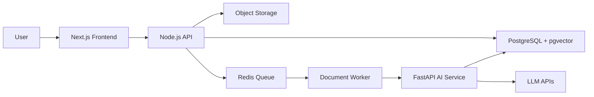

# Arkion DocIntel Capstone Blueprint

## Product Summary

Arkion DocIntel is an AI document intelligence platform for businesses.

Users can upload business documents, extract structured data, search semantically, ask questions with citations, compare documents, and run controlled AI workflows.

## Core User Stories

- As a user, I can upload a PDF document.
- As a user, I can see processing status.
- As a user, I can view extracted text and metadata.
- As a user, I can classify document type.
- As a user, I can extract structured fields.
- As a user, I can search documents using natural language.
- As a user, I can ask questions with source citations.
- As a user, I can compare two documents.
- As an admin, I can see usage, errors, and processing metrics.

## System Architecture

## Capstone Phases

1. Project setup
2. Document upload and processing
3. Document classification
4. Structured extraction
5. Embeddings and search
6. RAG Q&A
7. Document comparison
8. AI workflows
9. Evaluation layer
10. Production polish

## MVP Scope

The MVP should support:

- Local auth or simple user model
- Workspace model
- PDF upload
- Text extraction
- Document type classification
- Invoice and contract extraction
- Chunking
- Embedding storage
- Semantic search
- Single-document Q&A
- Source citations
- Basic evaluation set

## Later Scope

Add after MVP:

- OAuth
- Billing
- Multi-tenant RBAC
- Advanced OCR
- Document redaction
- Workflow builder
- Admin analytics
- Team collaboration

