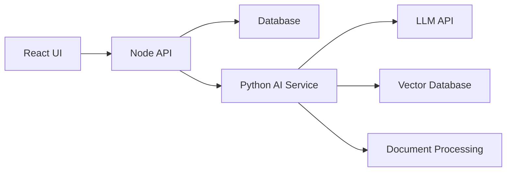
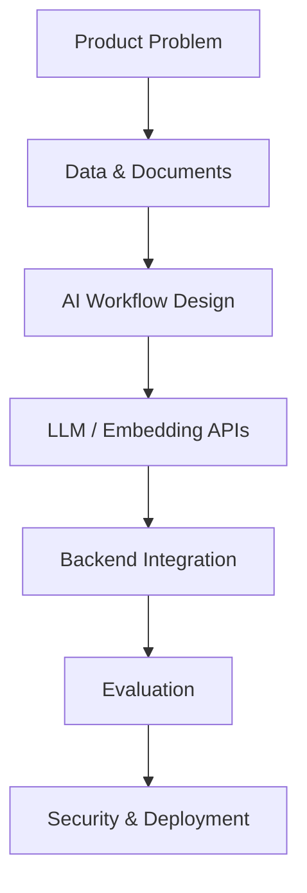

# Module 0: Career Strategy & Product Direction

## Module Purpose

This module sets the direction for the whole course.

You are not trying to become a pure ML researcher in 8 weeks. You are using your 5 years of full-stack MERN experience as leverage and adding applied AI engineering skills on top.

Target identity:

Senior Full Stack Engineer + Applied AI Engineer

This positioning is stronger than "MERN developer learning AI" because it tells companies you can ship complete AI products, not just call an API from a demo app.

## Why This Module Comes First

AI learning can become chaotic fast. There are too many topics:

- Python
- ML theory
- LLM APIs
- embeddings
- RAG
- agents
- vector databases
- fine-tuning
- LangChain
- evals
- MLOps
- deployment
- security

If you study everything randomly, you will feel busy but not become hireable.

This course uses one product, Orvion DocIntel, as the filter. If a topic helps you build or explain the product, it matters. If it only satisfies curiosity, it can wait.

## Product Direction

Working product name:

Orvion DocIntel

Product category:

AI Document Intelligence Platform for Businesses

One-line product pitch:

Orvion DocIntel helps businesses upload documents, extract structured information, search semantically, ask grounded questions with citations, compare documents, detect risks, and trigger AI workflows.

## What Companies Should See In This Project

When a hiring manager sees this project, they should not think:

"This is another chatbot."

They should think:

"This person understands full-stack product engineering, AI service architecture, document processing, retrieval, LLM reliability, data modeling, evaluation, and deployment."

## Research Notes

Current applied AI engineering expectations are product-heavy. Recent job descriptions and hiring discussions repeatedly mention:

- Python
- LLM APIs
- RAG
- agents or workflows
- evaluation and benchmarking
- production deployment
- cloud and backend systems
- observability
- security

That validates the course order:

Career strategy -> Python -> AI basics -> Document AI -> LLM APIs -> structured extraction -> embeddings -> RAG -> SaaS architecture -> workflows -> evals -> security -> deployment -> interviews.

## Learning Outcomes

By the end of this module, you should have:

- A clear target role
- A clear product story
- A clear skill-gap map
- A clear 8-week plan
- A clear capstone scope
- A first version of your interview pitch
- A decision about what to ignore for now

---

## 0.1 Why MERN-Only Positioning Is Limiting In The Current Market

### Goal

Understand why "MERN developer" is no longer enough as a high-differentiation identity and how to reposition without throwing away your existing experience.

### Plain-English Explanation

MERN is still valuable. React, Node.js, Express, MongoDB, TypeScript, API design, authentication, and deployment are real skills.

The problem is not that MERN became useless. The problem is that MERN became common.

Many developers can now build:

- dashboards
- CRUD apps
- admin panels
- e-commerce flows
- REST APIs
- auth systems
- basic SaaS apps

AI changes the expectation. Companies increasingly want engineers who can connect software systems to intelligent workflows:

- document understanding
- search over internal knowledge
- AI-assisted support
- workflow automation
- structured extraction
- summarization
- enterprise copilots
- AI-powered analytics

Your MERN background becomes more powerful when paired with AI because AI features still need normal product engineering:

- frontend UX
- backend APIs
- databases
- queues
- auth
- permissions
- billing
- logging
- testing
- deployment

### MERN-To-AI Mental Model

Think of your existing skill as the product shell.

AI engineering adds the intelligence layer.



### Product Connection

In Orvion DocIntel, MERN skills handle:

- user dashboard
- document library
- upload UI
- workspace management
- auth
- API gateway
- usage dashboard

AI engineering skills handle:

- PDF parsing
- extraction
- classification
- embeddings
- semantic search
- RAG answers
- risk analysis
- evaluation

### Common Mistake

Do not write your resume like you abandoned full-stack engineering. The strongest story is:

"I already know how to build complete products. I added applied AI so I can build the next generation of products."

### Interview Angle

Say:

"My full-stack background helps me build AI features as real product workflows, not isolated demos. I can design the UI, APIs, data model, background processing, AI service, and deployment path."

---

## 0.2 AI Engineer vs ML Engineer vs Data Scientist vs Full Stack AI Engineer

### Goal

Know which role you are targeting and which role you are not targeting yet.

### Role Comparison

| Role | Main Focus | Typical Skills | Your Fit |
|---|---|---|---|
| Data Scientist | Analysis, statistics, experiments, insights | Python, SQL, statistics, notebooks, BI | Medium |
| ML Engineer | Training, serving, optimizing ML models | ML algorithms, feature pipelines, model serving, infra | Medium later |
| AI Engineer | Building AI-powered applications | LLM APIs, RAG, agents, evals, backend, deployment | Strong |
| Applied AI Engineer | Production AI use cases for business | LLM workflows, retrieval, reliability, product integration | Strongest |
| Full Stack AI Engineer | End-to-end AI products | Frontend, backend, AI services, databases, cloud | Strongest |

### Your Best Target

Target:

- Applied AI Engineer
- Full Stack AI Engineer
- AI Product Engineer
- Senior Full Stack Engineer, AI Products
- LLM Application Engineer
- RAG Engineer

Avoid early:

- Research Scientist
- Computer Vision Researcher
- Deep Learning Research Engineer
- Core ML Infrastructure Engineer

Those roles require deeper math, research, model training, and systems specialization.

### Product Connection

Orvion DocIntel is designed for applied AI roles because it includes:

- LLM APIs
- document workflows
- embeddings
- RAG
- structured extraction
- evals
- SaaS architecture
- deployment

### Interview Angle

Say:

"I am not positioning myself as a model researcher. I am focused on applied AI engineering: building reliable AI-powered product workflows using LLMs, retrieval, structured extraction, evaluation, and full-stack architecture."

---

## 0.3 Best Target Roles For Your Background

### Goal

Create a practical job-search map.

### Tier 1 Roles

Apply aggressively to:

- Senior Full Stack Engineer, AI
- Applied AI Engineer
- AI Product Engineer
- Full Stack AI Engineer
- LLM Application Engineer
- RAG Engineer
- Backend Engineer, AI Platform

### Tier 2 Roles

Apply if the job description is application-focused:

- Machine Learning Engineer
- AI Platform Engineer
- Automation Engineer, AI
- Solutions Engineer, AI
- Developer Advocate, AI Tools

### Avoid For Now

Avoid roles where the description is mostly:

- PyTorch model training
- CUDA optimization
- research publications
- advanced statistics
- computer vision research
- PhD preferred
- building foundational models

### Skill Match Map

| Existing Strength | AI Add-On | Resulting Market Story |
|---|---|---|
| React | AI UX patterns | Can build usable AI interfaces |
| Node.js | AI API orchestration | Can integrate AI into product backends |
| Databases | vector search and metadata | Can build retrieval systems |
| SaaS thinking | multi-tenant AI workflows | Can build business AI products |
| APIs | LLM service layer | Can make AI reliable and reusable |
| Testing | evals | Can measure AI behavior |

---

## 0.4 Why Document Intelligence Is A Strong AI Engineering Portfolio Project

### Goal

Understand why this capstone is better than a generic chatbot.

### Why Documents Are Strong

Business documents are everywhere:

- contracts
- invoices
- HR policies
- proposals
- SOPs
- compliance documents
- offer letters
- resumes
- manuals
- support docs

They are also messy:

- scanned files
- bad formatting
- tables
- multi-page clauses
- missing fields
- duplicated content
- legal language
- inconsistent layouts
- sensitive information

That mess creates real engineering problems.

### Why This Impresses Interviewers

Document intelligence demonstrates:

- file upload architecture
- document parsing
- OCR awareness
- LLM prompt design
- structured outputs
- validation
- embeddings
- retrieval
- RAG
- citations
- risk analysis
- async processing
- evaluation
- security
- full-stack UX

### Product Comparison

Weak portfolio project:

"I built a chatbot."

Strong portfolio project:

"I built a document intelligence platform where users can upload business documents, extract structured fields, run semantic search, ask grounded questions with citations, compare documents, evaluate AI output quality, and manage secure workspaces."

---

## 0.5 How Orvion DocIntel Fits Under Orvion Labs

### Goal

Create a product story that sounds like a launchable business, not only a student project.

### Parent Brand

Orvion Labs can be positioned as a builder of business automation and AI productivity tools.

### Product Family

Orvion DocIntel can be the first product:

- document intelligence
- business workflow automation
- AI-powered document review
- extraction and search for SMBs

### Target Customers

Start with small and mid-sized businesses that handle repetitive documents:

- agencies
- finance teams
- HR consultancies
- legal operations teams
- procurement teams
- operations teams
- B2B service companies

### Initial Narrow Beachhead

Do not start by supporting every document type equally.

Start with:

1. invoices
2. contracts
3. HR policies

Why:

- invoices prove structured extraction
- contracts prove risk review and comparison
- policies prove RAG Q&A

### Product Positioning

Short:

"AI document intelligence for business teams."

Long:

"Orvion DocIntel helps business teams extract structured information, ask grounded questions, compare documents, and detect risks across contracts, invoices, policies, and operational documents."

---

## 0.6 What Companies Expect From Applied AI Engineers

### Goal

Understand the practical skills companies want.

### Core Expectations

Companies expect applied AI engineers to:

- understand product requirements
- choose the right model or API
- design prompts and schemas
- build retrieval pipelines
- use embeddings and vector search
- integrate LLMs into backend systems
- handle errors, retries, latency, and cost
- evaluate AI outputs
- protect sensitive data
- deploy and monitor AI features

### What They Usually Do Not Expect First

For applied roles, companies usually do not require you to:

- train foundation models
- invent transformer architectures
- write CUDA kernels
- publish ML papers
- know every ML algorithm deeply

### Practical Competency Pyramid



---

## 0.7 What To Learn And What To Ignore In The First 2 Months

### Learn Now

High priority:

- Python basics
- FastAPI
- Pydantic
- file handling
- PDF text extraction
- LLM API calls
- structured JSON outputs
- embeddings
- vector search
- RAG
- citations
- evaluation basics
- Docker basics
- security basics

### Learn Later

Lower priority for the first 8 weeks:

- deep ML math
- PyTorch training loops
- fine-tuning large models
- Kubernetes
- advanced MLOps
- custom model serving
- multi-agent research frameworks
- advanced OCR model training

### Ignore For Now

Avoid rabbit holes:

- chasing every AI framework
- comparing 30 vector databases
- building your own embedding model
- trying to learn all ML algorithms first
- making the UI perfect before the pipeline works

### Rule

If it does not help Orvion DocIntel work, explain, or deploy, it waits.

---

## 0.8 Final 8-Week Learning And Build Strategy

### Goal

Connect learning to weekly product progress.

### Strategy

Every week has two outputs:

1. Skill output: what you understand.
2. Product output: what Orvion DocIntel can do.

### Week Plan

| Week | Study Focus | Product Output |
|---|---|---|
| 1 | Python, FastAPI, AI basics | Upload API and text metadata |
| 2 | Document AI and LLM APIs | classification and summarization |
| 3 | Structured extraction | invoice and contract fields |
| 4 | Embeddings and search | semantic search |
| 5 | RAG | Q&A with citations |
| 6 | SaaS architecture and workflows | workspace, jobs, workflows |
| 7 | Evaluation, security, deployment | evals, safe logging, Docker |
| 8 | Interview and launch polish | README, demo, resume, LinkedIn |

### Weekly Review Questions

At the end of each week, answer:

- What can I build now?
- What can I explain now?
- What interview story improved this week?
- What is still fuzzy?
- What should I simplify?

---

## Capstone Scope For Module 0

No coding yet.

You should create:

- target role statement
- product one-liner
- product problem statement
- ideal customer profile
- initial document types
- 8-week execution agreement
- personal pitch draft

## Module 0 Assignment

Create a file called `career-positioning.md` in your portfolio folder and fill this:

```md
# Career Positioning

## Target Role

Applied AI Engineer / Full Stack AI Engineer

## Current Strengths

- React
- Node.js
- TypeScript
- APIs
- databases
- SaaS product delivery

## AI Skills I Am Adding

- Python
- FastAPI
- LLM APIs
- embeddings
- vector search
- RAG
- structured extraction
- evaluation
- AI workflows

## Product I Am Building

Orvion DocIntel, an AI document intelligence platform for businesses.

## My Pitch

I am a senior full-stack engineer expanding into applied AI engineering by building a production-style document intelligence platform with Python, FastAPI, LLMs, embeddings, vector search, RAG, structured extraction, AI workflows, evaluation, and deployment.
```

## Quiz

1. Why is "MERN developer" weaker positioning than "Full Stack AI Engineer"?
2. What is the difference between an ML Engineer and an Applied AI Engineer?
3. Why is document intelligence stronger than a generic chatbot project?
4. Which three document types should Orvion DocIntel support first?
5. What AI topics should be ignored during the first 8 weeks?

## Answer Key

1. MERN is common and mostly describes the implementation stack. Full Stack AI Engineer communicates product delivery plus AI-powered workflows.
2. ML Engineers often focus on training, serving, and optimizing models. Applied AI Engineers focus on building production applications using AI models, retrieval, workflows, evaluation, and product integration.
3. Document intelligence includes parsing, extraction, search, RAG, citations, comparison, evaluation, security, and SaaS architecture.
4. Invoices, contracts, and HR policies.
5. Advanced ML math, training large models, CUDA, Kubernetes, custom embedding models, and every new AI framework.

## Interview Questions

1. Why are you moving from MERN to AI engineering?
2. What kind of AI engineer are you trying to become?
3. Why did you choose document intelligence as your capstone?
4. How does your full-stack experience help in AI product engineering?
5. What does Orvion DocIntel do?

## Source Links

- Python documentation: https://docs.python.org/3/
- FastAPI documentation: https://fastapi.tiangolo.com/
- pytest documentation: https://docs.pytest.org/
- Pydantic documentation: https://docs.pydantic.dev/

