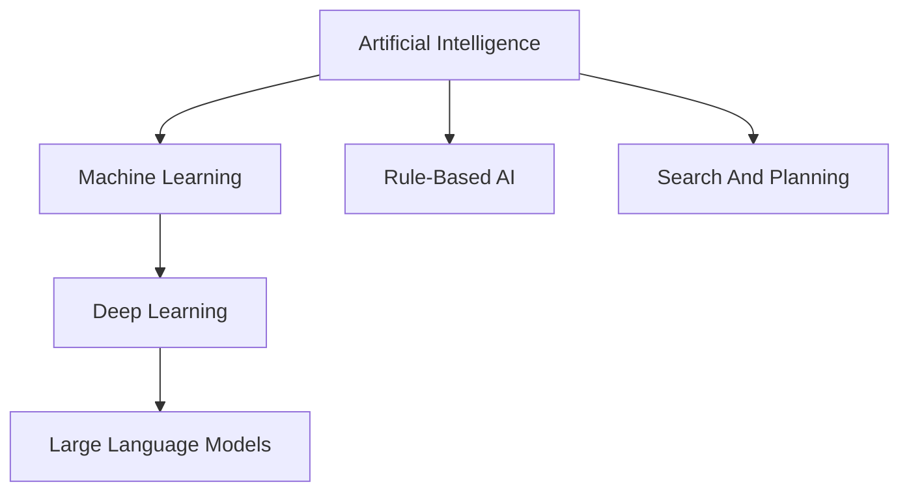
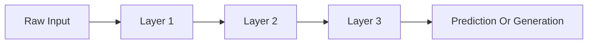
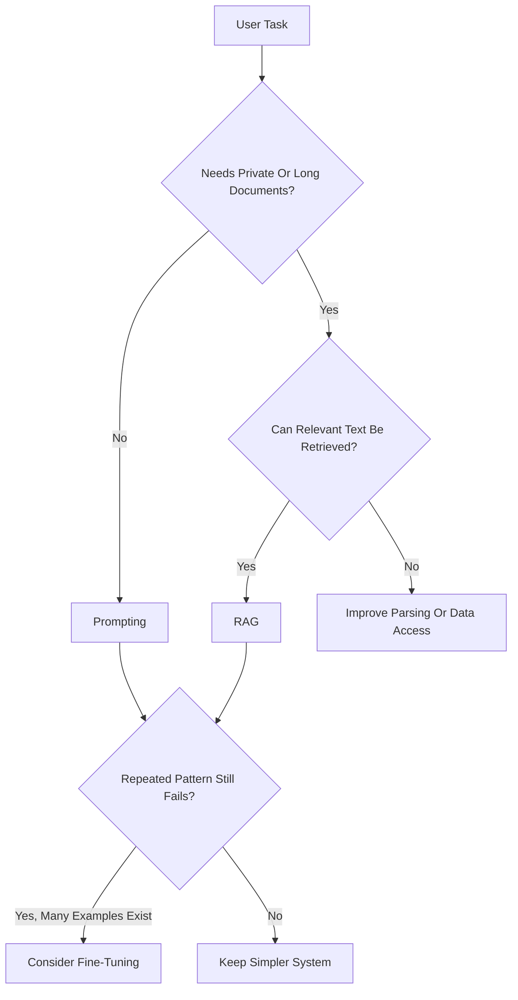

# Module 2: AI, ML, Generative AI & LLM Foundations

## Module Purpose

This module gives you the AI foundation needed to build Orvion DocIntel without drowning in research math too early.

You are not trying to become an ML researcher in this phase. You are learning enough AI, ML, LLM, embeddings, hallucination, grounding, and evaluation vocabulary to design and explain production AI features as a senior full-stack engineer.

The goal is simple:

- understand what the common AI terms actually mean
- know which concepts matter for document intelligence
- know when to use prompting, RAG, fine-tuning, or normal software
- be able to explain AI systems clearly in interviews
- prepare for Modules 3, 4, and 5 without jumping steps

## Learning Outcomes

By the end of this module, you should be able to:

- explain AI, ML, deep learning, generative AI, and LLMs in plain language
- describe tokens, context windows, embeddings, semantic similarity, and transformers
- explain inference parameters like temperature, top-p, max tokens, and stop sequences
- distinguish prompting, RAG, and fine-tuning
- explain hallucination and grounding
- understand why embeddings power semantic search
- explain basic ML interview terms like classification, regression, clustering, overfitting, precision, recall, and F1 score
- identify which ML theory can wait while building an applied AI portfolio project
- connect these concepts directly to Orvion DocIntel

## Final Mini Build

Create an AI concepts notebook or Markdown explainer for your own portfolio learning folder that contains:

- a glossary of core AI terms
- a one-page explanation of how an LLM request works
- a diagram showing prompting vs RAG vs fine-tuning
- five interview answers in your own words
- a decision table for when Orvion DocIntel should use rules, prompts, embeddings, RAG, or fine-tuning

This mini build is intentionally not a heavy coding lab. Module 1 already gave you FastAPI setup. Module 3 starts the document pipeline. Module 2 is the mental model layer between them.

---

## 2.1 What Is Artificial Intelligence?

### Goal

Understand AI as a broad category of systems that perform tasks normally associated with human intelligence.

### Plain-English Explanation

Artificial Intelligence means software that can perform tasks that seem to require intelligence.

Examples:

- classifying documents
- recognizing speech
- detecting fraud
- recommending products
- generating summaries
- answering questions
- extracting invoice fields
- identifying contract risks

AI is not one specific technology. It is an umbrella term.



### Product Connection

Orvion DocIntel uses AI when it classifies a document, extracts fields, searches by meaning, answers questions, summarizes content, and detects risks.

It also uses normal software: authentication, file upload, database storage, queues, permissions, and dashboards.

### Common Mistake

Do not call every feature AI. If a deterministic rule works reliably, use the rule.

### Interview Angle

Say:

"AI is the broad field of building systems that perform tasks associated with intelligence. In applied products, I care less about the label and more about choosing the right technique: deterministic rules, ML models, LLM prompts, embeddings, or RAG depending on the problem."

---

## 2.2 What Is Machine Learning?

### Goal

Understand ML as systems that learn patterns from data instead of being fully hand-coded.

### Plain-English Explanation

Machine Learning is a way to build systems that improve by learning patterns from examples.

Traditional software:

```text
if text contains "invoice":
    document_type = "invoice"
```

Machine learning:

```text
Show the model many examples of invoices, contracts, policies, and proposals.
The model learns patterns that help classify future documents.
```

### Types Of ML Tasks

| Task | Meaning | Document AI Example |
|---|---|---|
| Classification | Choose a category | invoice, contract, policy, proposal |
| Regression | Predict a number | estimate processing time or risk score |
| Clustering | Group similar items | group similar support documents |
| Ranking | Order by relevance | rank chunks for a search query |
| Extraction | Pull fields from content | invoice number, due date, parties |

### Product Connection

In Orvion DocIntel, you may start with simple rules for classification, then later use ML or LLM classification when documents become more varied.

### Common Mistake

Do not use ML just because it sounds advanced. If your training data is weak, simple rules plus human review may beat a fragile model.

---

## 2.3 What Is Deep Learning?

### Goal

Understand deep learning as ML based on large neural networks.

### Plain-English Explanation

Deep learning uses neural networks with many layers to learn complex patterns from data.

It is behind many modern AI systems:

- image recognition
- speech recognition
- translation
- embeddings
- large language models
- OCR models
- document layout models

### Mental Model

A deep learning model transforms input into useful representations.



### Product Connection

You do not need to train deep learning models to build Orvion DocIntel v1. But you will use products of deep learning: LLM APIs, embedding models, OCR models, and rerankers.

### Interview Angle

Say:

"Deep learning is a subset of machine learning based on multi-layer neural networks. For this project, I am mostly using pretrained deep learning models through APIs and libraries rather than training models from scratch."

---

## 2.4 What Is Generative AI?

### Goal

Understand generative AI as AI that creates new content.

### Plain-English Explanation

Generative AI creates outputs such as:

- text
- summaries
- code
- images
- audio
- structured JSON
- explanations

For Orvion DocIntel, generative AI is useful for:

- document summaries
- contract risk explanations
- policy answers
- proposal summaries
- extraction responses
- workflow recommendations

### Generative AI vs Predictive AI

| Type | What It Does | Example |
|---|---|---|
| Predictive AI | Predicts a label, number, or score | classify document as invoice |
| Generative AI | Generates new text or structured output | summarize contract risks |

### Common Mistake

Generated text can sound confident even when it is wrong. That is why grounding, citations, validation, and evaluation matter.

---

## 2.5 What Is An LLM?

### Goal

Understand Large Language Models as systems that generate and reason over language-like data.

### Plain-English Explanation

An LLM is a model trained on huge amounts of text and other data so it can predict and generate language.

LLMs can:

- summarize
- classify
- extract
- rewrite
- translate
- answer questions
- follow instructions
- generate code
- produce structured JSON

### What LLMs Are Good At

- understanding natural language
- transforming text into another form
- explaining concepts
- extracting information with the right prompt
- reasoning across provided context

### What LLMs Are Bad At

- knowing private documents unless you provide them
- guaranteeing factual accuracy without grounding
- doing exact arithmetic reliably
- following complex output formats without validation
- respecting permissions unless your app enforces them

### Product Connection

Orvion DocIntel uses LLMs as a reasoning and language layer, not as the whole product.

The product still needs:

- parsers
- schemas
- databases
- queues
- auth
- citations
- evaluation
- observability

---

## 2.6 How LLMs Understand Language

### Goal

Understand that LLMs do not read like humans; they process tokens and patterns.

### Plain-English Explanation

LLMs convert text into tokens, represent those tokens as numbers, and predict likely next tokens based on learned patterns and the current context.

They do not "understand" in a human way. They build statistical representations that are useful enough to perform language tasks.

### Simplified Flow


### Product Connection

When Orvion asks an LLM to extract invoice fields, the model is not opening a database of truth. It is predicting a structured response from the text you provide. Your app must validate that response.

### Common Mistake

Do not assume an LLM "knows" your uploaded document unless the relevant text is included in the request or retrieved through RAG.

---

## 2.7 What Are Tokens?

### Goal

Understand tokens because they affect cost, speed, limits, and output quality.

### Plain-English Explanation

Tokens are pieces of text used by language models.

A token can be:

- a word
- part of a word
- punctuation
- whitespace pattern
- code fragment

Example:

```text
"Invoice total is $1,200"
```

This may become several tokens, not exactly one token per word.

### Why Tokens Matter

Tokens affect:

- API cost
- latency
- context window usage
- maximum answer length
- how much document text fits into a request

### Product Connection

Business documents can be long. You cannot blindly send every document to the model every time. Later, embeddings and RAG help you retrieve only relevant chunks.

---

## 2.8 What Is Context Window?

### Goal

Understand the model's working memory limit.

### Plain-English Explanation

The context window is the amount of text the model can consider in one request.

It includes:

- system instructions
- user prompt
- document text
- retrieved chunks
- previous conversation
- expected output

### Product Problem

A contract may be longer than the useful context budget. Even when it fits, sending the whole thing every time can be slow and expensive.

### Better Pattern


### Product Connection

This is why Module 6 teaches chunking and embeddings before Module 7 teaches RAG.

---

## 2.9 What Are Embeddings?

### Goal

Understand embeddings as numeric representations of meaning.

### Plain-English Explanation

An embedding is a list of numbers that represents the meaning of text.

Example idea:

```json
"payment due date" -> [0.12, -0.44, 0.91, ...]
```

Texts with similar meaning have embeddings that are close together.

### Why This Matters

Keyword search looks for exact words.

Semantic search looks for meaning.

Query:

```text
When do we need to pay?
```

Relevant document text:

```text
Payment shall be made within thirty days of invoice receipt.
```

Keyword search may miss this. Embedding search can find it.

### Product Connection

Embeddings let Orvion DocIntel search documents by meaning, not just exact text.

---

## 2.10 What Is Semantic Similarity?

### Goal

Understand how AI search finds related meaning.

### Plain-English Explanation

Semantic similarity measures whether two pieces of text mean similar things.

These are semantically similar:

- "termination clause"
- "how can either party end the agreement?"
- "conditions for ending the contract"

They may not share the same keywords, but they point to the same concept.

### Product Connection

When a user asks, "Can we cancel this contract early?", Orvion should retrieve termination clauses even if the document never says "cancel."

### Common Mistake

Semantic similarity is powerful, but not perfect. It can retrieve text that feels related but does not answer the question. Reranking and citations help.

---

## 2.11 What Is Cosine Similarity?

### Goal

Understand the common math idea behind vector similarity without getting stuck in formulas.

### Plain-English Explanation

Cosine similarity compares the direction of two vectors.

For embeddings, the direction often represents meaning. If two vectors point in a similar direction, the texts are likely related.

### Tiny Mental Model

```text
similar meaning       -> vectors point similar direction -> high score
different meaning     -> vectors point different direction -> low score
opposite relationship -> vectors point apart -> lower score
```

### Product Connection

When Orvion searches document chunks, the vector database can rank chunks by similarity to the user's query embedding.

### Interview Angle

Say:

"Cosine similarity is commonly used to compare embeddings because it measures directional similarity between vectors, which often maps well to semantic similarity."

---

## 2.12 What Is A Transformer?

### Goal

Understand the architecture idea behind modern LLMs.

### Plain-English Explanation

A transformer is a neural network architecture designed to process sequences of tokens and learn relationships between them.

The key idea is attention.

Attention helps the model decide which tokens matter most when processing another token.

Example:

```text
The contract renews automatically unless either party gives notice.
```

To understand "renews", the model may pay attention to "automatically", "unless", "party", and "notice."

### Product Connection

You do not need to implement transformers. You need to know enough to explain why LLMs are good at language tasks and why context quality matters.

### Common Mistake

Do not spend your first two months trying to build transformers from scratch. For applied AI engineering, use existing models and build reliable systems around them.

---

## 2.13 Training Vs Fine-Tuning Vs Prompting

### Goal

Know how model behavior can be created or influenced.

### Training

Training builds a model from large datasets. This is expensive and not your first path.

### Fine-Tuning

Fine-tuning adapts an existing model using examples.

Useful when:

- you have many high-quality examples
- output style or task behavior must be consistent
- prompting is not enough

### Prompting

Prompting gives instructions and context at request time.

Useful when:

- you are building quickly
- the task changes often
- you need to include user-specific documents
- you do not have enough labeled examples yet

### Product Decision

For Orvion DocIntel v1:

- use prompting for classification, extraction, and summaries
- use embeddings and RAG for document Q&A
- collect examples and evaluation data
- consider fine-tuning later only if repeated failures justify it

---

## 2.14 What Is Inference?

### Goal

Understand what happens when you call a model in production.

### Plain-English Explanation

Inference means using a trained model to produce an output for a new input.

When your backend sends a document prompt to an LLM API and receives a summary, that is inference.

### Inference Concerns

In production, you care about:

- latency
- cost
- rate limits
- output quality
- safety
- retries
- timeouts
- observability

### Product Connection

Orvion DocIntel will run inference for summaries, extraction, Q&A, comparison, and risk review. Module 4 turns this into a reusable service layer.

---

## 2.15 Temperature, Top-p, Max Tokens, And Stop Sequences

### Goal

Understand common LLM controls.

### Temperature

Temperature controls randomness.

| Temperature | Behavior | Good For |
|---|---|---|
| Low | More predictable | extraction, classification, factual answers |
| Medium | Balanced | summaries, explanations |
| High | More creative | brainstorming, marketing copy |

For Orvion extraction, prefer low temperature.

### Top-p

Top-p controls how many likely token options the model considers. It is another way to control randomness.

In early projects, do not over-tune both temperature and top-p. Keep defaults unless you have a reason.

### Max Tokens

Max tokens limits the output length.

Use it to:

- control cost
- prevent runaway answers
- keep extraction responses compact

### Stop Sequences

Stop sequences tell the model when to stop generating.

They are useful in some structured formats, but schema-based outputs and validation are usually more important for your course path.

---

## 2.16 Hallucination And Grounding

### Goal

Understand the biggest trust problem in LLM products.

### Hallucination

Hallucination means the model produces information that is unsupported or false.

Example:

User asks:

```text
What is the termination notice period?
```

The document does not mention it.

Bad answer:

```text
The notice period is 30 days.
```

Better answer:

```text
The document does not specify a termination notice period.
```

### Grounding

Grounding means forcing the answer to rely on provided sources.

In Orvion, grounding comes from:

- retrieved document chunks
- citations
- page numbers
- evidence snippets
- refusal when information is missing

### Product Connection

Document intelligence is only useful if users trust it. Grounding is how you move from "AI says" to "AI points to the source."

---

## 2.17 Prompting Vs RAG Vs Fine-Tuning

### Goal

Choose the right AI technique for the job.

### Decision Table

| Need | Best First Choice | Why |
|---|---|---|
| Summarize one short document | Prompting | Context fits directly |
| Extract invoice fields | Prompting + schema validation | Structured response needed |
| Ask questions across many documents | RAG | Need retrieval from private data |
| Improve consistent style | Prompting first, fine-tune later | Start simple |
| Teach model private company docs | RAG | Private data changes often |
| Fix repeated extraction pattern failures | Fine-tuning may help later | Needs examples |

### Diagram



### Product Connection

Orvion DocIntel should not start with fine-tuning. Start with parsing, prompts, structured schemas, embeddings, RAG, and evaluation.

---

## 2.18 What AI Concepts Matter Most For Interviews

### Goal

Know the vocabulary that interviewers expect from an applied AI engineer.

### Core Concepts

| Concept | What To Say |
|---|---|
| Classification | Predicting a category such as invoice or contract |
| Regression | Predicting a numeric value |
| Clustering | Grouping similar items without predefined labels |
| Embeddings | Numeric representations of semantic meaning |
| Vector similarity | Comparing embeddings to retrieve related content |
| RAG | Retrieval plus generation to answer using external sources |
| Hallucination | Unsupported or false model output |
| Grounding | Making output depend on provided evidence |
| Precision | Of what the system returned, how much was correct |
| Recall | Of what should have been found, how much was found |
| F1 score | Balance between precision and recall |
| Overfitting | Model memorizes training patterns and fails on new data |
| Underfitting | Model is too weak to capture useful patterns |

### Interview Answer Pattern

Use this structure:

1. Define the concept simply.
2. Give a document intelligence example.
3. Mention a production concern.

Example:

"Embeddings are numeric representations of meaning. In Orvion DocIntel, I use embeddings to search contract chunks by semantic similarity, so a user can ask 'how do we terminate?' and retrieve relevant clauses even if the document uses different wording. In production I would evaluate retrieval quality, metadata filters, and citation correctness."

---

## 2.19 What ML Theory Can Wait

### Goal

Avoid getting stuck in theory before building portfolio value.

### Learn Now

Focus now on:

- Python basics
- FastAPI
- LLM API calls
- prompt design
- structured outputs
- embeddings
- vector search
- RAG
- evaluation basics
- security and privacy
- deployment

### Can Wait

These can wait until after your first production-style AI project:

- deriving backpropagation
- training neural networks from scratch
- advanced linear algebra proofs
- custom transformer implementation
- research paper reproduction
- distributed model training
- GPU optimization

### Why

Your target role is:

```text
Senior Full Stack Engineer + Applied AI Engineer
```

That role rewards the ability to build reliable AI products end to end.

### Common Mistake

Do not confuse "I do not know every ML equation yet" with "I cannot build applied AI systems." You can build real systems while continuing to deepen theory over time.

---

## Flow Check: How Module 2 Connects To Modules 3-5

Module 2 is the concept bridge.

Module 3 uses these concepts like this:

- AI vs normal software helps you decide when to use rules for document classification.
- Tokens and context windows explain why long PDFs cannot be blindly sent to an LLM.
- Hallucination explains why parsed text and source locations matter.

Module 4 uses these concepts like this:

- LLMs, prompts, inference, temperature, and max tokens become API request design.
- Hallucination and grounding become prompt rules and validation behavior.
- Prompting vs fine-tuning explains why a reusable AI service layer comes before model customization.

Module 5 uses these concepts like this:

- Structured generation becomes JSON extraction.
- Grounding becomes evidence fields and page numbers.
- Evaluation vocabulary becomes extraction accuracy testing.

No step should feel like magic after this module. Module 3 begins the document pipeline, Module 4 adds controlled LLM calls, and Module 5 turns model output into validated business data.

## Capstone Scope For Module 2

Create your AI foundation notes inside the course repo or your personal study folder.

Recommended files:

```text
notes/
  ai-foundation-glossary.md
  prompting-vs-rag-vs-finetuning.md
  interview-answers-module-02.md
```

## Module 2 Assignment

Build:

- a glossary with at least 25 AI terms
- a Mermaid diagram explaining the LLM request lifecycle
- a decision table for rules vs prompts vs embeddings vs RAG vs fine-tuning
- five interview answers in your own words
- a one-page explanation of how Orvion DocIntel will use AI without becoming "just a chatbot"

Acceptance criteria:

- every definition is understandable to a non-AI software engineer
- every concept includes a document intelligence example
- RAG, embeddings, hallucination, grounding, and fine-tuning are clearly distinguished
- the notes explain why Module 3 comes before Module 4 and Module 5

## Quiz

1. What is the difference between AI and ML?
2. What is deep learning?
3. What is generative AI?
4. What is an LLM?
5. Why do tokens matter?
6. What is a context window?
7. What are embeddings?
8. Why is semantic search better than keyword search for many document questions?
9. What does cosine similarity compare?
10. What is hallucination?
11. What is grounding?
12. When should Orvion use RAG instead of a direct prompt?
13. Why should fine-tuning not be the first solution?
14. What is precision?
15. What is recall?

## Answer Key

1. AI is the broad field of intelligent software behavior. ML is a subset where systems learn patterns from data.
2. Deep learning is ML based on multi-layer neural networks.
3. Generative AI creates content such as text, summaries, code, images, or structured output.
4. An LLM is a large language model that processes tokens and generates language-like output.
5. Tokens affect cost, latency, context limits, and output size.
6. The context window is the amount of input and output text the model can consider in one request.
7. Embeddings are numeric representations of meaning.
8. Semantic search can find related meaning even when exact keywords differ.
9. Cosine similarity compares the direction of two vectors, often used to compare embedding similarity.
10. Hallucination is unsupported or false model output.
11. Grounding means tying model output to provided evidence or sources.
12. Use RAG when answers require private, long, or changing document content that must be retrieved.
13. Fine-tuning needs high-quality examples and usually comes after prompts, RAG, and evaluation reveal repeatable failures.
14. Precision measures how much of what the system returned was correct.
15. Recall measures how much of the correct target information the system found.

## Interview Questions

1. Explain AI, ML, deep learning, generative AI, and LLMs as if speaking to a product manager.
2. How would you explain tokens and context windows to a backend engineer?
3. Why are embeddings useful for document search?
4. What is the difference between prompting and RAG?
5. When would you consider fine-tuning?
6. How do hallucinations happen, and how do you reduce them?
7. How would you evaluate whether document Q&A is reliable?
8. Why is Orvion DocIntel stronger than a basic chatbot project?

## Source Links

- OpenAI API documentation: https://platform.openai.com/docs
- Hugging Face NLP Course: https://huggingface.co/learn/nlp-course/
- Google Machine Learning Crash Course: https://developers.google.com/machine-learning/crash-course
- Stanford CS224N course: https://web.stanford.edu/class/cs224n/
- scikit-learn model evaluation guide: https://scikit-learn.org/stable/modules/model_evaluation.html
- JSON Schema documentation: https://json-schema.org/
