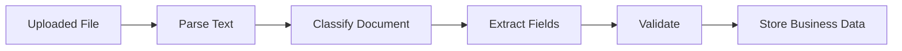
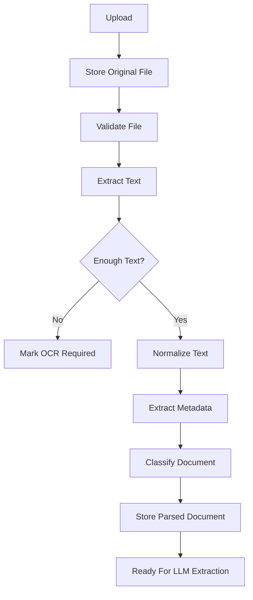

# Module 3: Document AI Fundamentals

## Module Purpose

This module teaches the document-processing layer behind Arkion DocIntel.

A generic chatbot starts with clean text typed by a user. A document intelligence product starts with messy files: PDFs, scans, invoices, contracts, tables, headers, footers, missing pages, signatures, stamps, page numbers, and formatting that can break simple text extraction.

Your goal is to understand the path from uploaded file to AI-ready document text.

## Learning Outcomes

By the end of this module, you should be able to:

- explain what Document AI is
- distinguish digital PDFs from scanned PDFs
- extract text from text-based PDFs
- detect likely scanned documents
- explain when OCR is needed
- preserve page numbers and source locations
- identify document metadata
- classify basic document types
- describe table, layout, and multi-page parsing issues
- design the first ingestion pipeline for Arkion DocIntel

## Final Mini Build

Extend the Module 1 FastAPI service with:

- uploaded PDF text extraction
- `.txt` text extraction
- document metadata response
- scanned-document detection heuristic
- basic document type classification
- page-aware extracted text structure
- safe parser error handling

---

## 3.1 What Is Document AI?

### Goal

Understand Document AI as a product workflow, not just "reading PDFs."

### Plain-English Explanation

Document AI means using software and AI models to understand documents and turn them into useful actions or data.

That can include:

- extracting text
- identifying document type
- extracting key fields
- detecting tables
- finding clauses
- summarizing content
- answering questions with citations
- comparing documents
- routing documents into workflows

### MERN-To-AI Mental Model

In a normal MERN app, a user submits clean form data:

```json
{
  "vendor": "Acme Corp",
  "total": 1200
}
```

In Document AI, the user uploads a messy file and your system has to create that structure.



### Product Connection

Arkion DocIntel starts by turning contracts, invoices, and policies into clean text and metadata. Every later feature depends on this foundation.

### Common Mistakes

- assuming every PDF contains selectable text
- throwing away page numbers
- treating tables as normal paragraphs
- sending raw broken text directly to an LLM
- logging sensitive document content

### Interview Angle

Say:

"Document AI is the pipeline that converts unstructured or semi-structured business files into searchable, extractable, and actionable data. The hard part is not only the LLM call; it is ingestion, parsing, layout handling, validation, and reliability."

---

## 3.2 Why Business Documents Are Hard To Process

### Goal

Learn the messy realities that make document products more impressive than simple chat demos.

### Plain-English Explanation

Business documents are designed for humans, not APIs. They often contain visual structure that is obvious to a person but difficult for software.

Examples:

- invoice totals in bottom-right corners
- contract clauses split across pages
- headers repeated on every page
- scanned pages with no embedded text
- tables with merged cells
- signatures and stamps
- footnotes and small-print terms
- columns that extraction libraries read in the wrong order

### Product Connection

If Arkion DocIntel extracts a wrong invoice total or misses a termination clause, the product becomes untrustworthy. Parsing quality affects business value.

### Mini Exercise

Take one invoice PDF, one contract PDF, and one HR policy PDF. Open each and list:

- what content is structured
- what content is free-form
- what data a business user would want extracted
- what could break automatic parsing

---

## 3.3 Digital PDFs Vs Scanned PDFs

### Goal

Understand the first major branch in a document pipeline.

### Digital PDF

A digital PDF contains embedded text. You can usually select and copy the words.

Common sources:

- exported invoices
- generated contracts
- Google Docs or Word exports
- software-generated reports

### Scanned PDF

A scanned PDF is mostly images of pages. The file may look like text, but software sees pixels.

Common sources:

- scanned contracts
- photographed documents
- old legal paperwork
- signed paper forms

### Detection Heuristic

If PDF text extraction returns almost no text across pages, it is probably scanned.

```python
def is_likely_scanned(extracted_text: str, page_count: int) -> bool:
    if page_count == 0:
        return False

    average_chars = len(extracted_text.strip()) / page_count
    return average_chars < 50
```

### Common Mistake

Do not call every low-text PDF "empty." It may need OCR.

---

## 3.4 Text Extraction From PDFs

### Goal

Extract text from text-based PDFs while preserving page boundaries.

### Recommended First Tool

For a beginner-friendly local pipeline, use `pypdf`.

Install:

```powershell
pip install pypdf
```

Example:

```python
from pathlib import Path
from pypdf import PdfReader

def extract_pdf_pages(path: Path) -> list[dict[str, str | int]]:
    reader = PdfReader(str(path))
    pages = []

    for index, page in enumerate(reader.pages, start=1):
        text = page.extract_text() or ""
        pages.append({"page_number": index, "text": text})

    return pages
```

### Product Connection

Store page-aware text because citations later need to say "page 4" or "section 7.2."

### Common Mistakes

- storing one giant string only
- removing page numbers too early
- assuming extraction order is always correct
- not catching parser exceptions

---

## 3.5 OCR Basics

### Goal

Know what OCR does and when to use it.

### Plain-English Explanation

OCR means Optical Character Recognition. It turns images of text into machine-readable text.

OCR is needed when:

- PDF pages are scanned images
- text is inside screenshots
- signatures or stamps contain important text
- photos of documents are uploaded

### Practical Options

Local and open-source:

- Tesseract
- OCRmyPDF

Cloud and managed:

- AWS Textract
- Google Document AI
- Azure Document Intelligence

### Product Decision

For the first Arkion DocIntel build:

- support digital PDFs first
- detect scanned PDFs
- return a clear "OCR required" status
- add OCR later as a separate pipeline step

### Interview Angle

Say:

"I would not silently fail on scanned PDFs. I would detect low text density, mark the document as OCR-required, and route it through a dedicated OCR step or managed document AI service."

---

## 3.6 Layout-Aware Document Processing

### Goal

Understand why text order and visual layout matter.

### Plain-English Explanation

Layout-aware processing keeps track of where text appears on the page. This matters because documents communicate meaning through position.

Examples:

- invoice total near the bottom
- table column labels above values
- contract headings before clauses
- footnotes at the bottom

### Simple vs Advanced Extraction

Simple extraction gives:

```text
Total
1200
Subtotal
1000
Tax
200
```

Layout-aware extraction can preserve:

```json
{
  "label": "Total",
  "value": "1200",
  "page": 1,
  "region": "bottom_right"
}
```

### Product Connection

Module 5 structured extraction becomes more reliable when the parser keeps page and layout hints.

---

## 3.7 Handling Tables

### Goal

Learn why tables require special care.

### Plain-English Explanation

Tables contain relationships between rows and columns. Plain text extraction often destroys those relationships.

Invoice line items need structure:

```json
[
  {
    "description": "Consulting services",
    "quantity": 10,
    "unit_price": 100,
    "amount": 1000
  }
]
```

Bad extraction may produce:

```text
Consulting services 10 100 1000
```

That may be usable for humans, but it is fragile for automated extraction.

### Tools To Know Later

- Camelot
- Tabula
- pdfplumber
- managed document extraction APIs

### Common Mistake

Do not promise perfect table extraction early. Start with document-level fields, then add table extraction after the basic pipeline is stable.

---

## 3.8 Handling Multi-Page Documents

### Goal

Process long documents without losing context or source references.

### Plain-English Explanation

Multi-page documents create several problems:

- clauses can start on one page and continue on the next
- headers and footers repeat
- page numbers may be extracted as body text
- long documents exceed LLM context limits
- citations need stable page references

### Page-Aware Data Shape

```python
class ExtractedPage(BaseModel):
    page_number: int
    text: str

class ExtractedDocument(BaseModel):
    document_id: str
    file_name: str
    page_count: int
    pages: list[ExtractedPage]
    full_text: str
```

### Product Connection

This structure supports:

- page citations
- chunking in Module 6
- RAG in Module 7
- contract clause review

---

## 3.9 Metadata Extraction

### Goal

Capture useful file and parser metadata.

### Useful Metadata

Store:

- document ID
- original file name
- extension
- content type
- file size
- page count
- text character count
- parser name
- parser status
- scanned detection result
- created timestamp

### Example Response

```json
{
  "document_id": "doc_123",
  "file_name": "vendor-invoice.pdf",
  "page_count": 2,
  "text_char_count": 4210,
  "is_likely_scanned": false,
  "parser_status": "parsed"
}
```

### Common Mistake

Do not store only extracted text. Metadata is how you debug, filter, evaluate, and explain the system.

---

## 3.10 Document Classification

### Goal

Identify whether a document is an invoice, contract, HR policy, proposal, or unknown.

### Simple Rule-Based Classifier

Start with rules before using an LLM.

```python
def classify_document(text: str) -> str:
    lowered = text.lower()

    if "invoice" in lowered or "amount due" in lowered:
        return "invoice"

    if "agreement" in lowered or "termination" in lowered or "governing law" in lowered:
        return "contract"

    if "employee" in lowered and ("policy" in lowered or "leave" in lowered):
        return "hr_policy"

    if "proposal" in lowered or "scope of work" in lowered:
        return "proposal"

    return "unknown"
```

### Product Connection

Classification decides which extraction schema to use in Module 5.

### Interview Angle

Say:

"I would begin with simple deterministic classification for obvious cases, then use an LLM classifier for ambiguous documents, and track confidence and fallbacks."

---

## 3.11 Entity Extraction

### Goal

Understand the difference between finding entities and extracting full structured records.

### Plain-English Explanation

Entities are important pieces of text:

- company names
- dates
- amounts
- addresses
- clause names
- people
- document IDs

Entity extraction answers:

"What important things appear in this text?"

Structured extraction answers:

"What is the exact business record this document represents?"

### Product Connection

Entity extraction helps Arkion DocIntel identify parties, dates, amounts, and obligations before building full extraction schemas.

---

## 3.12 Key-Value Extraction

### Goal

Learn a common pattern in invoices and forms.

### Plain-English Explanation

Key-value extraction finds labels and their values.

Examples:

| Key | Value |
|---|---|
| Invoice Number | INV-1004 |
| Due Date | 2026-06-15 |
| Total Amount | 1240.00 |
| Vendor | Acme Services |

### Product Connection

Invoices, offer letters, insurance forms, and applications often depend on key-value extraction.

### Common Mistake

Do not assume the label is always next to the value. It may be above, below, or far away in the layout.

---

## 3.13 Clause Extraction From Contracts

### Goal

Understand contract-specific document intelligence.

### Important Clauses

Common clauses to detect:

- termination
- renewal
- payment terms
- confidentiality
- limitation of liability
- indemnity
- governing law
- dispute resolution
- data processing

### Product Connection

Arkion DocIntel can summarize a contract and flag risky or missing clauses.

### Mini Exercise

Pick one contract and manually mark:

- parties
- effective date
- term
- termination clause
- payment terms
- liability clause

This becomes your future extraction target.

---

## 3.14 Invoice Field Extraction

### Goal

Identify the first invoice fields Arkion should extract.

### Core Fields

Start with:

- invoice number
- vendor name
- customer name
- issue date
- due date
- subtotal
- tax
- total amount
- currency
- payment terms

### Why Invoices Are Good First

Invoices prove that your product can turn documents into business data.

### Product Connection

Module 5 will convert these fields into a Pydantic extraction schema.

---

## 3.15 Policy Document Understanding

### Goal

Understand how policy documents differ from invoices and contracts.

### Plain-English Explanation

Policy documents are less about fixed fields and more about rules, procedures, and answers.

Important policy information:

- who the policy applies to
- eligibility rules
- approval process
- exceptions
- effective date
- responsible department
- escalation path

### Product Connection

Policies are excellent for RAG because users ask questions like:

"How many paid leave days do employees get?"

"What is the approval process for remote work?"

---

## 3.16 Common Document Parsing Failures

### Goal

Recognize failure modes before they become production bugs.

### Failure Cases

- no text extracted from scanned PDF
- columns read in wrong order
- table rows merged incorrectly
- page headers pollute content
- footers appear inside paragraphs
- document language is unsupported
- encrypted PDF cannot be parsed
- extremely large file times out
- malformed PDF crashes parser
- total amount confused with subtotal

### Defensive Design

For each parsed document, store:

- parser status
- error message if failed
- text length
- page count
- scanned flag
- document type

### Common Mistake

Do not hide parser failures behind a generic success response.

---

## 3.17 Production Document AI System Design

### Goal

See the full ingestion architecture.

### Pipeline



### Product Connection

This module completes the ingestion foundation. Module 4 adds LLM calls. Module 5 turns the parsed text into structured business data.

---

## Capstone Scope For Module 3

Add a parser service to the Module 1 lab.

Recommended files:

```text
app/
  services/
    parser_service.py
    classification_service.py
  models/
    parsing.py
tests/
  test_parser_service.py
```

## Module 3 Assignment

Build:

- `extract_txt(path)`
- `extract_pdf_pages(path)`
- `is_likely_scanned(text, page_count)`
- `classify_document(text)`
- `POST /documents/{document_id}/parse`

Acceptance criteria:

- `.txt` files parse correctly
- digital PDFs return page-aware text
- low-text PDFs are marked as likely scanned
- parser errors return clear API errors
- document type is one of `invoice`, `contract`, `hr_policy`, `proposal`, or `unknown`

## Quiz

1. What is Document AI?
2. What is the difference between a digital PDF and a scanned PDF?
3. Why should extracted text preserve page numbers?
4. When is OCR required?
5. Why are tables difficult to parse?
6. What metadata should be stored after parsing?
7. Why should document classification happen before structured extraction?
8. Name three common parsing failures.

## Answer Key

1. Document AI is the process of converting documents into searchable, extractable, and actionable data using parsing, OCR, AI models, validation, and workflows.
2. A digital PDF contains embedded selectable text. A scanned PDF contains page images and usually needs OCR.
3. Page numbers are needed for citations, debugging, chunking, and user trust.
4. OCR is required when important text exists only as an image.
5. Tables encode meaning through rows and columns, which plain text extraction often destroys.
6. File name, size, extension, page count, text length, parser status, scanned flag, document type, timestamps, and parser errors.
7. Classification chooses the correct extraction schema and workflow.
8. Scanned PDF with no text, wrong column order, broken tables, repeated headers, encrypted PDFs, parser crashes, and timeouts.

## Interview Questions

1. How would you design a document ingestion pipeline?
2. How do you detect scanned PDFs?
3. Why is OCR not always the first step?
4. What makes contract parsing harder than plain text summarization?
5. How would you handle parser failures in production?
6. How does document classification support downstream AI workflows?

## Source Links

- pypdf documentation: https://pypdf.readthedocs.io/
- Tesseract OCR documentation: https://tesseract-ocr.github.io/
- OCRmyPDF documentation: https://ocrmypdf.readthedocs.io/
- AWS Textract documentation: https://docs.aws.amazon.com/textract/
- Google Document AI documentation: https://cloud.google.com/document-ai/docs
- Azure Document Intelligence documentation: https://learn.microsoft.com/azure/ai-services/document-intelligence/
