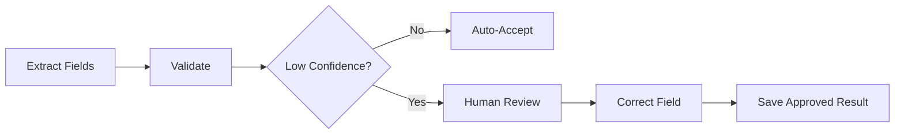

# Module 5: Structured Document Extraction

## Module Purpose

This module turns document text into business data.

Module 3 gave you parsed text. Module 4 gave you an LLM service layer. Module 5 combines them into structured extraction: invoices become invoice records, contracts become contract review objects, policies become rules and procedures, and proposals become opportunity summaries.

## Learning Outcomes

By the end of this module, you should be able to:

- explain structured extraction
- design JSON schemas for documents
- create Pydantic extraction models
- extract invoice fields
- extract contract fields
- extract HR policy fields
- extract proposal fields
- handle missing and uncertain values
- add confidence and evidence fields
- design human review workflows
- export extracted data
- store extraction results
- test extraction accuracy

## Final Mini Build

Build the first structured extraction pipeline for Arkion DocIntel:

- choose schema based on document type
- call the AI service with schema-specific prompts
- validate output with Pydantic
- store extraction result
- mark low-confidence fields for review
- expose extracted fields through an API response

---

## 5.1 What Is Structured Extraction?

### Goal

Understand the core value of document intelligence.

### Plain-English Explanation

Structured extraction turns messy document content into predictable fields.

Invoice text becomes:

```json
{
  "invoice_number": "INV-1004",
  "vendor_name": "Acme Services",
  "total_amount": 1240.0,
  "currency": "USD"
}
```

Contract text becomes:

```json
{
  "parties": ["Acme Services", "Arkion Labs"],
  "effective_date": "2026-05-01",
  "termination_notice_days": 30
}
```

### Product Connection

This is where Arkion DocIntel stops being "document chat" and becomes a business tool.

---

## 5.2 Why JSON Outputs Matter

### Goal

Use structured outputs that software can trust.

### Plain-English Explanation

Humans like paragraphs. Applications need fields.

JSON lets Arkion:

- display extracted fields in a dashboard
- filter invoices by due date
- export CSV
- compare contracts
- trigger workflows
- validate output
- store results consistently

### Common Mistake

Do not ask the model for a nice explanation when the backend needs a typed object.

---

## 5.3 Designing Extraction Schemas

### Goal

Learn how to choose fields carefully.

### Schema Design Rules

Good extraction schemas are:

- specific
- business-oriented
- typed
- tolerant of missing values
- explicit about evidence
- versioned

### Field Pattern

For important fields, store more than the value:

```json
{
  "value": "2026-06-15",
  "confidence": 0.88,
  "evidence": "Payment due by June 15, 2026",
  "page_number": 1
}
```

### Product Connection

Evidence and page numbers build trust. A business user can verify where the field came from.

---

## 5.4 Pydantic Models For Document Extraction

### Goal

Represent extraction results as validated Python objects.

### Reusable Field Model

```python
from pydantic import BaseModel, Field

class ExtractedField(BaseModel):
    value: str | float | int | bool | None = None
    confidence: float | None = Field(default=None, ge=0, le=1)
    evidence: str | None = None
    page_number: int | None = Field(default=None, ge=1)
```

### Base Result Model

```python
class ExtractionResult(BaseModel):
    document_id: str
    document_type: str
    schema_version: str
    fields: dict[str, ExtractedField]
    requires_review: bool = False
```

### Common Mistake

Do not use `dict` everywhere forever. Pydantic gives you validation, documentation, and safer refactoring.

---

## 5.5 Invoice Extraction Schema

### Goal

Design the first production-useful invoice schema.

### Core Fields

```python
class InvoiceExtraction(BaseModel):
    invoice_number: ExtractedField
    vendor_name: ExtractedField
    customer_name: ExtractedField
    issue_date: ExtractedField
    due_date: ExtractedField
    subtotal: ExtractedField
    tax_amount: ExtractedField
    total_amount: ExtractedField
    currency: ExtractedField
    payment_terms: ExtractedField
```

### Validation Rules

Check:

- total amount is not negative
- due date is not before issue date when both exist
- currency uses a recognizable code or symbol
- invoice number is not empty for high-confidence extraction

### Product Connection

Invoice extraction supports finance search, exports, and automation.

---

## 5.6 Contract Extraction Schema

### Goal

Extract contract facts and risk-relevant clauses.

### Core Fields

```python
class ContractExtraction(BaseModel):
    parties: list[ExtractedField]
    effective_date: ExtractedField
    end_date: ExtractedField
    renewal_terms: ExtractedField
    termination_clause: ExtractedField
    payment_terms: ExtractedField
    confidentiality_clause: ExtractedField
    liability_clause: ExtractedField
    governing_law: ExtractedField
    risky_terms: list[ExtractedField]
    missing_clauses: list[str]
```

### Product Connection

This powers contract review, risk flags, and comparison workflows.

### Common Mistake

Do not reduce contract extraction to only summary. Contracts need specific clauses and evidence.

---

## 5.7 HR Policy Extraction Schema

### Goal

Extract rules and procedures from policy documents.

### Core Fields

```python
class HRPolicyExtraction(BaseModel):
    policy_name: ExtractedField
    effective_date: ExtractedField
    owner_department: ExtractedField
    applies_to: ExtractedField
    eligibility_rules: list[ExtractedField]
    approval_process: list[ExtractedField]
    exceptions: list[ExtractedField]
    escalation_contact: ExtractedField
```

### Product Connection

Policy extraction prepares documents for RAG and helps HR teams find rules quickly.

---

## 5.8 Proposal Extraction Schema

### Goal

Extract useful sales and delivery fields from proposals.

### Core Fields

```python
class ProposalExtraction(BaseModel):
    client_name: ExtractedField
    vendor_name: ExtractedField
    proposal_date: ExtractedField
    scope_summary: ExtractedField
    deliverables: list[ExtractedField]
    timeline: ExtractedField
    pricing: ExtractedField
    assumptions: list[ExtractedField]
    exclusions: list[ExtractedField]
```

### Product Connection

Proposal extraction helps compare scope, pricing, and delivery commitments.

---

## 5.9 Handling Missing Fields

### Goal

Prevent hallucinated extraction.

### Rule

Missing is better than guessed.

Use:

```json
{
  "value": null,
  "confidence": 0,
  "evidence": null,
  "page_number": null
}
```

### Prompt Instruction

```text
If the document does not explicitly contain a field, return null. Do not infer or guess.
```

### Product Connection

A review-required missing field is safer than a fake field shown confidently.

---

## 5.10 Confidence Scoring

### Goal

Use confidence as a workflow signal, not as magic truth.

### Plain-English Explanation

Confidence estimates how reliable a field seems. It can come from:

- model self-assessment
- parser quality
- validation results
- evidence presence
- agreement between multiple methods

### Simple Review Rule

```python
def requires_field_review(field: ExtractedField) -> bool:
    if field.value is None:
        return True

    if field.confidence is None:
        return True

    return field.confidence < 0.75
```

### Common Mistake

Do not treat model confidence as perfectly calibrated. Use it as a triage signal.

---

## 5.11 Validation And Correction

### Goal

Catch obvious extraction mistakes before users see them.

### Validation Examples

- total amount must be numeric
- due date must be a date
- currency should be normalized
- required fields can be missing but should trigger review
- page number must be within document page count
- evidence should not be empty for high-confidence values

### Correction Examples

- convert `$1,240.00` into `1240.00` plus `USD`
- normalize `15 June 2026` into `2026-06-15`
- trim whitespace
- convert empty string to null

### Product Connection

Validation and correction make AI output usable in normal software systems.

---

## 5.12 Human Review Workflow

### Goal

Design for human approval instead of pretending AI is perfect.

### Workflow



### Review UI Needs

Show:

- extracted value
- confidence
- evidence snippet
- page number
- editable corrected value
- approve or reject action

### Product Connection

Human review makes Arkion credible for finance, legal, and HR workflows.

---

## 5.13 Exporting Extracted Data

### Goal

Turn extracted fields into practical business output.

### Export Formats

Support:

- JSON for APIs
- CSV for spreadsheets
- later: Excel
- later: accounting or CRM integrations

### CSV Example

```csv
document_id,invoice_number,vendor_name,total_amount,currency,due_date
doc_123,INV-1004,Acme Services,1240,USD,2026-06-15
```

### Common Mistake

Do not export low-confidence fields without review status.

---

## 5.14 Storing Extracted Fields In Database

### Goal

Understand early storage design.

### Simple Relational Shape

```text
documents
  id
  file_name
  document_type
  parser_status

extraction_results
  id
  document_id
  schema_version
  status
  created_at

extracted_fields
  id
  extraction_result_id
  field_name
  value_text
  confidence
  evidence
  page_number
  review_status
```

### Alternative

Store the full validated JSON in a `jsonb` column, then later add indexed relational fields for common filters.

### Product Connection

Arkion can start with JSON storage, then optimize fields used for filtering and reporting.

---

## 5.15 Extraction Accuracy Testing

### Goal

Measure whether extraction is improving.

### Golden Dataset

A golden dataset contains documents with expected answers.

Example:

```json
{
  "document": "invoice_acme_001.pdf",
  "expected": {
    "invoice_number": "INV-1004",
    "total_amount": 1240.0,
    "currency": "USD"
  }
}
```

### Metrics

Track:

- exact match for IDs and dates
- numeric tolerance for amounts
- missing field rate
- false extraction rate
- review rate
- schema validation pass rate

### Product Connection

This becomes the foundation for Module 10 evaluation and observability.

---

## Capstone Scope For Module 5

Build the extraction workflow.

Recommended files:

```text
app/
  models/
    extraction.py
  services/
    extraction_service.py
  ai/
    extraction_prompts.py
tests/
  test_extraction_models.py
  test_extraction_service.py
```

## Module 5 Assignment

Build:

- `ExtractedField`
- `InvoiceExtraction`
- `ContractExtraction`
- `HRPolicyExtraction`
- `ProposalExtraction`
- `select_schema_for_document_type(document_type)`
- `requires_review(extraction_result)`
- `POST /documents/{document_id}/extract`
- `GET /documents/{document_id}/extraction`

Acceptance criteria:

- schemas validate successfully
- missing fields use null instead of guesses
- low-confidence fields trigger review
- extraction response includes schema version
- output includes evidence and page numbers where available
- tests cover valid and invalid extraction payloads

## Quiz

1. What is structured extraction?
2. Why is JSON better than free-form text for extracted fields?
3. Why should important fields include evidence?
4. What should happen when a field is missing?
5. Why is confidence not the same as truth?
6. What fields should an invoice schema include?
7. What fields should a contract schema include?
8. Why is human review important?
9. What is a golden dataset?
10. Which extraction metrics should be tracked?

## Answer Key

1. Turning unstructured or semi-structured document content into predictable typed fields.
2. JSON can be validated, stored, displayed, filtered, exported, and used by workflows.
3. Evidence lets users verify where a value came from and supports citations.
4. Return null, low confidence, and review-required status instead of guessing.
5. Model confidence can be poorly calibrated; it is a triage signal, not proof.
6. Invoice number, vendor, customer, dates, subtotal, tax, total, currency, and payment terms.
7. Parties, dates, renewal, termination, payment terms, confidentiality, liability, governing law, risky terms, and missing clauses.
8. AI extraction can be uncertain; human review makes high-value workflows safer.
9. A set of documents with expected answers used to test extraction quality.
10. Exact match, numeric tolerance, missing field rate, false extraction rate, review rate, and validation pass rate.

## Interview Questions

1. How would you design a structured extraction pipeline?
2. How do you avoid hallucinated fields?
3. How would you validate LLM extraction output?
4. How do confidence and human review fit into document AI?
5. How would you store extracted document fields?
6. How would you test invoice extraction accuracy?
7. How does structured extraction differ from summarization?

## Source Links

- Pydantic models: https://docs.pydantic.dev/latest/concepts/models/
- Pydantic validators: https://docs.pydantic.dev/latest/concepts/validators/
- JSON Schema: https://json-schema.org/
- PostgreSQL JSON types: https://www.postgresql.org/docs/current/datatype-json.html
- FastAPI response models: https://fastapi.tiangolo.com/tutorial/response-model/
