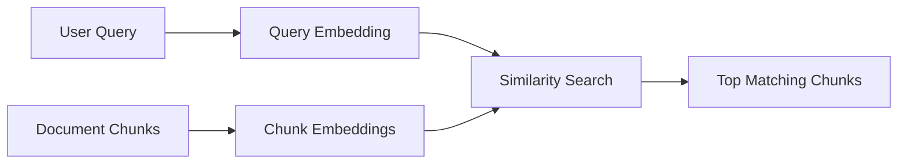

# Module 6: Embeddings, Vector Search & Semantic Search

## Module Purpose

This module teaches the retrieval foundation behind Arkion DocIntel.

Modules 3-5 turned files into parsed text and structured business data. Now you need search by meaning. Users will not always ask with the same words used inside a document. They may ask "when do we pay?" while the contract says "payment shall be remitted within thirty days." Embeddings and vector search solve that gap.

## Learning Outcomes

By the end of this module, you should be able to:

- explain embeddings and semantic search clearly
- chunk document text without destroying meaning
- choose useful chunk size and overlap
- design metadata for filters and citations
- compare pgvector, Pinecone, Qdrant, and Weaviate
- store embeddings with document chunks
- run semantic search over a workspace
- filter search by document type, date, and tenant
- explain hybrid search and reranking
- debug weak retrieval results

## Final Mini Build

Extend Arkion DocIntel with:

- page-aware chunk generation
- embedding generation service
- vector storage table or collection
- semantic search API
- metadata filters for workspace and document type
- search results with chunk text, document ID, page number, and score

---

## 6.1 What Are Embeddings?

Embeddings are numeric representations of meaning. A paragraph, sentence, or query becomes a vector: a list of numbers.

```json
{
  "text": "Payment is due within 30 days.",
  "embedding": [0.12, -0.44, 0.81]
}
```

In real models, the vector has hundreds or thousands of dimensions.

Product use: Arkion embeds document chunks and user queries so it can compare meaning.

## 6.2 Why Keyword Search Is Not Enough

Keyword search finds exact words. Business users ask questions in natural language, and documents often use formal wording.

| User Query | Document Text |
|---|---|
| Can we cancel early? | Either party may terminate this agreement with written notice. |
| When do we pay? | Net 30 from receipt of invoice. |
| Is there auto renewal? | The agreement renews automatically for successive one-year terms. |

Keyword search is still useful, especially for IDs and exact terms. Semantic search adds meaning.

## 6.3 Semantic Search Explained

Semantic search converts the query and stored chunks into embeddings, compares them, and returns the closest matches.



This is the retrieval step that later feeds RAG.

## 6.4 Cosine Similarity

Cosine similarity measures whether two vectors point in a similar direction.

For search:

- high score means likely related
- low score means weak relationship
- score is not proof of correctness

You should show citations and evaluate results instead of trusting scores blindly.

## 6.5 Embedding Models

An embedding model turns text into vectors.

Selection criteria:

- quality for your language and domain
- vector dimensions
- cost
- latency
- provider reliability
- privacy constraints

Start with a hosted embedding model for speed. Later you can test open-source embedding models if cost or privacy requires it.

## 6.6 Chunking Strategies

Chunking splits long document text into smaller searchable pieces.

Common approaches:

- fixed-size chunks
- paragraph-based chunks
- heading-aware chunks
- page-aware chunks
- clause-aware chunks for contracts

For Arkion v1, use page-aware paragraph chunks, then improve per document type.

## 6.7 Chunk Size And Overlap

Small chunks are precise but may miss context. Large chunks preserve context but may retrieve extra noise.

Starting point:

```text
chunk_size: 800-1200 tokens
overlap: 100-200 tokens
```

Use overlap when a clause or policy rule spans chunk boundaries.

## 6.8 Metadata Design

Metadata makes search usable in a SaaS product.

Store:

- chunk ID
- document ID
- workspace ID
- document type
- page number
- chunk index
- source file name
- created date
- parser version

Metadata allows tenant isolation, filters, citations, and debugging.

## 6.9 Vector Databases

A vector database stores embeddings and performs nearest-neighbor search.

For your first portfolio build, PostgreSQL with pgvector is a strong choice because it keeps relational data and vectors together.

## 6.10 pgvector Vs Pinecone Vs Qdrant Vs Weaviate

| Option | Best For | Tradeoff |
|---|---|---|
| pgvector | Simple SaaS with Postgres | Less specialized at huge scale |
| Pinecone | Managed vector search | Extra vendor and cost |
| Qdrant | Open-source vector database | More infra to operate |
| Weaviate | Rich vector platform | More moving parts |

Recommendation: start with pgvector, mention alternatives in interviews.

## 6.11 Storing Embeddings

Example table shape:

```sql
create table document_chunks (
  id uuid primary key,
  document_id uuid not null,
  workspace_id uuid not null,
  page_number int,
  chunk_index int not null,
  content text not null,
  embedding vector(1536),
  metadata jsonb,
  created_at timestamptz default now()
);
```

Always store the original chunk text with the embedding. The vector alone is not useful for citations.

## 6.12 Searching Embeddings

Search flow:

1. Embed the user query.
2. Filter by workspace and permissions.
3. Search nearest chunks.
4. Return top results with score and source metadata.

API shape:

```json
{
  "query": "What is the payment term?",
  "filters": { "document_type": "contract" },
  "top_k": 5
}
```

## 6.13 Filtering By Metadata

Filters protect both relevance and security.

Use filters for:

- workspace ID
- user permissions
- document type
- date range
- folder
- document IDs

Never search vectors globally and filter security afterward.

## 6.14 Hybrid Search

Hybrid search combines keyword search and vector search.

Useful for:

- invoice numbers
- exact contract section names
- employee IDs
- vendor names
- semantic questions

The product can start with semantic search, then add keyword plus vector ranking later.

## 6.15 Reranking Basics

Reranking takes the top initial results and reorders them with a stronger model.

Flow:


Reranking improves answer quality but adds cost and latency. Add it after baseline search works.

## 6.16 Search Quality Debugging

When search feels bad, inspect:

- query text
- retrieved chunks
- chunk size
- overlap
- document metadata
- embedding model
- filters
- top_k
- score distribution
- whether the answer exists in parsed text

Do not blame the LLM before checking retrieval.

## Capstone Scope For Module 6

Recommended files:

```text
app/
  services/
    chunking_service.py
    embedding_service.py
    search_service.py
  models/
    chunks.py
tests/
  test_chunking_service.py
  test_search_service.py
```

## Module 6 Assignment

Build:

- `chunk_document_pages(pages)`
- `generate_embedding(text)`
- `store_document_chunk(chunk)`
- `semantic_search(query, workspace_id, filters)`
- `GET /documents/search?q=...`

Acceptance criteria:

- chunks preserve document ID and page number
- search is scoped by workspace
- results include content, score, and citation metadata
- filters work by document type
- tests cover chunking boundaries

## Quiz

1. What is an embedding?
2. Why is semantic search useful for business documents?
3. Why does chunk size matter?
4. What metadata should every chunk store?
5. Why should security filters happen before vector search?
6. When is hybrid search useful?
7. What does a reranker do?
8. What should you inspect when retrieval quality is poor?

## Answer Key

1. A numeric representation of text meaning.
2. It finds related meaning even when exact words differ.
3. It controls precision, context, cost, and retrieval quality.
4. Workspace ID, document ID, page number, chunk index, source file, document type, and parser details.
5. To prevent cross-tenant or unauthorized results from appearing.
6. When exact identifiers and semantic meaning both matter.
7. It reorders candidate results using a stronger relevance model.
8. Query, chunks, filters, scores, chunking strategy, metadata, and whether the source text exists.

## Interview Questions

1. How would you implement semantic search over uploaded documents?
2. Why did you choose pgvector for the first version?
3. How do chunk size and overlap affect RAG?
4. How do you enforce tenant isolation in vector search?
5. How would you debug poor retrieval quality?

## Source Links

- pgvector: https://github.com/pgvector/pgvector
- Qdrant documentation: https://qdrant.tech/documentation/
- Pinecone documentation: https://docs.pinecone.io/
- Weaviate documentation: https://weaviate.io/developers/weaviate
