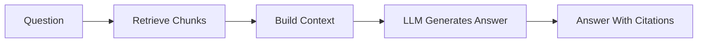

# Module 7: RAG For Business Documents

## Module Purpose

This module teaches Retrieval-Augmented Generation, the core pattern behind grounded document Q&A.

RAG lets Arkion DocIntel answer questions using uploaded business documents instead of relying only on what a model already knows. The system retrieves relevant chunks, builds context, generates an answer, and cites sources.

## Learning Outcomes

By the end of this module, you should be able to:

- explain RAG clearly
- design ingestion, retrieval, and generation pipelines
- construct useful context for an LLM
- return source citations
- handle unknown answers safely
- build single-document and multi-document Q&A
- compare documents using retrieval
- debug common RAG failures
- explain RAG in interviews

## Final Mini Build

Build Arkion DocIntel Q&A:

- ask a question on one document
- ask across a workspace
- retrieve relevant chunks
- generate a grounded answer
- show citations with document name and page number
- return "I do not know" when evidence is missing

---

## 7.1 What Is RAG?

RAG means Retrieval-Augmented Generation.

The system retrieves relevant external context, then asks an LLM to generate an answer using that context.



## 7.2 Why RAG Is Needed For Document Intelligence

LLMs do not automatically know private uploaded documents. RAG connects the model to your document store at request time.

Use RAG when:

- documents are private
- content changes often
- answers need citations
- documents exceed context limits
- users ask across many files

## 7.3 RAG Pipeline Overview

RAG has three major pipelines:

| Pipeline | Job |
|---|---|
| Ingestion | Parse, chunk, embed, and store documents |
| Retrieval | Find chunks relevant to a question |
| Generation | Use chunks to answer with citations |

Each pipeline needs logging and evaluation.

## 7.4 Ingestion Pipeline

Ingestion prepares documents before the user asks questions.

Steps:

1. Upload file.
2. Parse text.
3. Preserve page numbers.
4. Chunk text.
5. Generate embeddings.
6. Store chunks and metadata.

Bad ingestion creates bad RAG even if the LLM is strong.

## 7.5 Retrieval Pipeline

Retrieval finds candidate evidence.

Steps:

1. Receive question.
2. Apply workspace and permission filters.
3. Embed the question.
4. Search vector store.
5. Optionally rerank results.
6. Return top chunks.

## 7.6 Generation Pipeline

Generation asks the LLM to answer from retrieved evidence.

Prompt rule:

```text
Answer only using the provided sources. If the sources do not contain the answer, say you do not know.
```

## 7.7 Context Construction

Context should be structured, not dumped randomly.

Example:

```text
Source 1: vendor-contract.pdf, page 4
Text: Either party may terminate with 30 days written notice.

Source 2: vendor-contract.pdf, page 7
Text: Payment shall be made within 30 days of invoice receipt.
```

## 7.8 Source Citations

Citations turn an AI answer into a trustworthy product answer.

Citation metadata:

- source document
- page number
- chunk ID
- quote or evidence snippet
- confidence or retrieval score

## 7.9 Grounded Answering

Grounded answers are supported by retrieved evidence.

Bad:

```text
The contract is risky.
```

Better:

```text
The contract includes auto-renewal and does not mention a liability cap. See vendor-contract.pdf pages 3 and 8.
```

## 7.10 Handling Unknown Answers

Unknown handling is a product feature, not a weakness.

Return:

```text
I could not find that information in the selected documents.
```

Do not invent missing data.

## 7.11 Single-Document Q&A

Single-document Q&A filters retrieval to one document ID.

Use cases:

- ask questions about one contract
- inspect one HR policy
- review one proposal

## 7.12 Multi-Document Q&A

Multi-document Q&A searches across a workspace or folder.

Use cases:

- "Which invoices are overdue?"
- "Which vendor agreements have Net 30 terms?"
- "What policies mention remote work?"

## 7.13 Cross-Document Search

Cross-document search returns relevant chunks without necessarily generating a long answer.

It is useful for discovery and audits.

## 7.14 Document Comparison

Comparison uses retrieval to gather matching topics from two documents, then asks the LLM to compare.

Compare:

- payment terms
- termination clauses
- pricing
- renewal terms
- deliverables

## 7.15 Contract Risk Analysis Using RAG

Risk review retrieves important clauses and checks them against a review rubric.

Risk examples:

- auto-renewal
- missing liability cap
- broad indemnity
- unclear termination
- unfavorable governing law

## 7.16 Policy Q&A Using RAG

Policy Q&A needs conservative answers because employees may act on them.

Always cite:

- policy name
- section or page
- effective date if available

## 7.17 Invoice Search Using RAG

Invoices often need structured filters plus semantic search.

Use structured fields for:

- due date
- amount
- vendor
- status

Use RAG for:

- notes
- payment terms
- exceptions
- dispute language

## 7.18 RAG Failure Cases

Common failures:

- source text was parsed badly
- chunking split the answer
- retrieval missed the right chunk
- too many irrelevant chunks were included
- model ignored the context
- answer had no citation
- citation pointed to the wrong page

## 7.19 RAG Debugging

Debug in this order:

1. Is the answer present in extracted text?
2. Did chunking preserve it?
3. Did retrieval find it?
4. Did context include it?
5. Did the LLM answer from it?
6. Did citations map correctly?

## 7.20 RAG Interview Questions

Be ready to explain:

- why RAG over fine-tuning for private documents
- how citations are generated
- how tenant isolation works
- how retrieval quality is evaluated
- how unknown answers are handled

## Capstone Scope For Module 7

Recommended files:

```text
app/
  services/
    rag_service.py
    citation_service.py
  ai/
    rag_prompts.py
tests/
  test_rag_service.py
```

## Module 7 Assignment

Build:

- `answer_document_question(document_id, question)`
- `answer_workspace_question(workspace_id, question)`
- citation mapping from chunks
- unknown-answer handling
- comparison prompt for two documents

Acceptance criteria:

- every answer includes citations or an unknown response
- retrieval is permission-scoped
- document Q&A and workspace Q&A are separate paths
- comparison uses evidence from both documents
- tests cover missing-answer behavior

## Quiz

1. What does RAG stand for?
2. Why is RAG useful for private documents?
3. What are the three major RAG pipelines?
4. Why are citations important?
5. What should happen when evidence is missing?
6. What is the difference between single-document and workspace Q&A?
7. Name three RAG failure cases.
8. What is the first thing to check when RAG gives a bad answer?

## Answer Key

1. Retrieval-Augmented Generation.
2. It retrieves private document context at request time.
3. Ingestion, retrieval, and generation.
4. They let users verify answers and build trust.
5. The system should say it cannot find the answer.
6. Single-document Q&A filters to one document; workspace Q&A searches many authorized documents.
7. Bad parsing, poor chunking, weak retrieval, irrelevant context, unsupported generation, wrong citation.
8. Check whether the answer exists in extracted text.

## Interview Questions

1. How would you design a RAG system for contracts?
2. Why not fine-tune the model on uploaded documents?
3. How do you generate citations?
4. How do you evaluate RAG quality?
5. How do you prevent cross-tenant data leakage in RAG?

## Source Links

- OpenAI documentation: https://platform.openai.com/docs
- LangChain RAG concepts: https://python.langchain.com/docs/tutorials/rag/
- LlamaIndex documentation: https://docs.llamaindex.ai/
- pgvector: https://github.com/pgvector/pgvector
