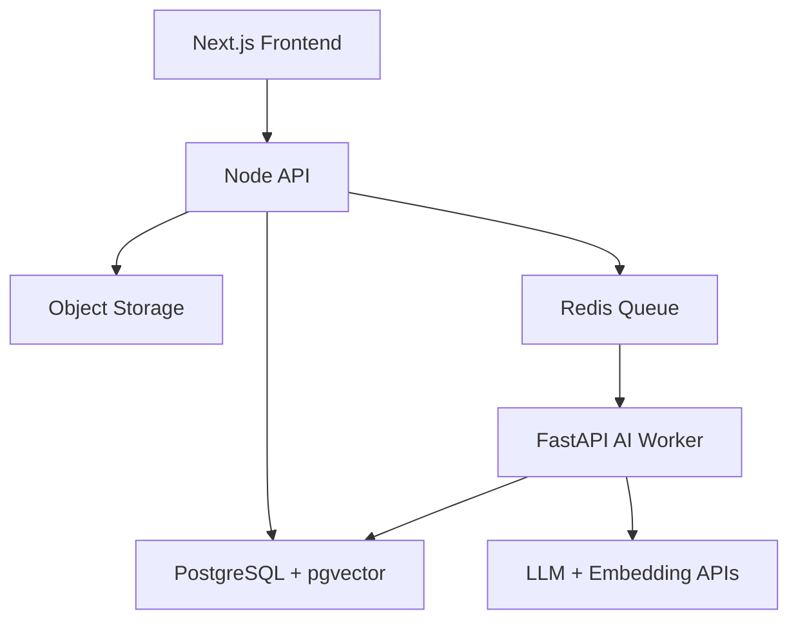

# Module 8: Full Stack AI SaaS Architecture

## Module Purpose

This module turns your MERN background into an advantage.

Many people can build notebooks. Fewer can build a real AI SaaS with auth, uploads, queues, storage, databases, AI services, permissions, loading states, and admin visibility. Arkion DocIntel should look like a serious product, not an API demo.

## Learning Outcomes

By the end of this module, you should be able to:

- design a full-stack AI SaaS architecture
- separate frontend, Node backend, Python AI service, database, queue, and storage responsibilities
- explain async processing for document workflows
- design a multi-tenant workspace model
- define API contracts between services
- model documents, chunks, extraction results, jobs, and audit logs
- design product UI states for uploads and processing
- explain the architecture in system design interviews

## Final Mini Build

Create the Arkion DocIntel architecture blueprint:

- monorepo structure
- service boundaries
- database schema draft
- processing pipeline
- API contract list
- UI route map
- architecture diagram

---

## 8.1 Full-Stack AI App Architecture

Recommended architecture:



## 8.2 Why AI Apps Need Async Processing

Document processing can take seconds or minutes.

Async processing avoids:

- request timeouts
- frozen UI
- duplicate uploads
- hard-to-retry failures

Upload creates a job. Worker processes the job. UI polls or subscribes to status.

## 8.3 Frontend Responsibilities

Frontend owns:

- login screens
- workspace navigation
- document library
- upload UI
- processing status
- document detail pages
- extraction review UI
- chat and search UI
- comparison UI
- admin dashboards

## 8.4 Backend Responsibilities

Node backend owns:

- auth checks
- workspace permissions
- document records
- upload orchestration
- signed URLs
- API contracts
- billing hooks later
- user-facing business logic

## 8.5 AI Service Responsibilities

FastAPI AI service owns:

- parsing
- chunking
- embedding
- classification
- extraction
- RAG answer generation
- workflow execution
- eval helpers

Keep AI-specific Python logic out of frontend routes.

## 8.6 Node.js Backend Vs Python Backend

Use Node for SaaS product logic and Python for AI pipelines.

Node is strong for your existing MERN skills. Python is stronger for document parsing, AI libraries, evaluation, and ML tooling.

## 8.7 Microservice Vs Modular Monolith

Do not over-split early.

Good first structure:

- Next.js frontend
- Node API
- FastAPI AI service
- worker process
- shared database

This is enough to tell a serious architecture story.

## 8.8 Multi-Tenant SaaS Design

Core entities:

- user
- organization
- workspace
- membership
- role
- document
- job
- extraction result
- audit log

Every document and vector chunk must belong to a workspace or organization.

## 8.9 Workspace And Organization Model

Use organizations for companies and workspaces for document collections.

Example:

```text
Organization: Acme Ltd
  Workspace: Legal
  Workspace: Finance
  Workspace: HR
```

## 8.10 User Roles And Permissions

Start with:

- owner
- admin
- editor
- viewer

Permissions control uploads, deletion, review approval, exports, and admin dashboards.

## 8.11 File Upload Architecture

Flow:

1. Frontend requests upload permission.
2. Backend creates document record.
3. File uploads to object storage.
4. Backend creates processing job.
5. Worker processes file.

Do not send large files through unnecessary service hops.

## 8.12 Document Processing Pipeline

Pipeline:


## 8.13 Background Jobs

Jobs need:

- ID
- type
- status
- attempts
- error message
- timestamps
- document ID
- workspace ID

Use Redis with BullMQ on Node or Celery/RQ on Python.

## 8.14 Job Status Tracking

Statuses:

- queued
- processing
- needs_review
- completed
- failed

The UI should show meaningful progress, not a spinner forever.

## 8.15 API Contract Design

API examples:

```text
POST /documents
GET /documents
GET /documents/:id
POST /documents/:id/process
GET /documents/:id/extraction
POST /documents/search
POST /documents/:id/questions
POST /documents/compare
```

## 8.16 Database Schema Design

Core tables:

- users
- organizations
- memberships
- workspaces
- documents
- document_pages
- document_chunks
- extraction_results
- jobs
- audit_logs
- ai_usage_events

## 8.17 Audit Logs

Audit logs answer:

- who uploaded a document
- who viewed it
- who exported data
- who deleted it
- which AI workflow ran

Sensitive SaaS products need auditability.

## 8.18 Error Handling

Error categories:

- upload failed
- unsupported file type
- parser failed
- OCR required
- AI provider failed
- validation failed
- permission denied

Show actionable states in the UI.

## 8.19 Frontend Loading States

For document processing, use staged states:

- uploading
- queued
- extracting text
- analyzing document
- generating embeddings
- ready
- failed

Users should understand what is happening.

## 8.20 Admin Dashboard Basics

Admin dashboard should show:

- documents processed
- failed jobs
- token usage
- storage usage
- average processing time
- top workflows
- review queue count

## Capstone Scope For Module 8

Build architecture docs before coding more features.

Recommended files:

```text
docs/
  architecture.md
  api-contracts.md
  database-schema.md
  processing-pipeline.md
```

## Module 8 Assignment

Create:

- architecture diagram
- API list
- database schema draft
- job status model
- UI route map

Acceptance criteria:

- every AI feature has a service owner
- every document record has tenant ownership
- async processing is represented
- UI states match backend statuses

## Quiz

1. Why do AI document apps need queues?
2. What should the Node backend own?
3. What should the Python service own?
4. Why does every vector chunk need workspace metadata?
5. What job statuses should the UI support?
6. Why are audit logs important?

## Answer Key

1. Processing can be slow and needs retries outside request lifetimes.
2. Auth, permissions, product APIs, workspace logic, upload orchestration.
3. Parsing, chunking, embeddings, extraction, RAG, workflows, eval helpers.
4. For tenant isolation, filtering, citations, and debugging.
5. Queued, processing, needs review, completed, failed.
6. Sensitive document systems need traceability for compliance and trust.

## Interview Questions

1. Design a full-stack document intelligence SaaS.
2. Why split Node and Python services?
3. How would you model workspaces and permissions?
4. How would you process uploads asynchronously?
5. How would the frontend track job status?

## Source Links

- FastAPI documentation: https://fastapi.tiangolo.com/
- BullMQ documentation: https://docs.bullmq.io/
- PostgreSQL documentation: https://www.postgresql.org/docs/
- Redis documentation: https://redis.io/docs/latest/
