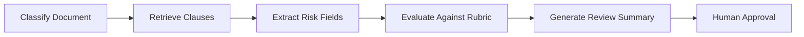

# Module 9: Agentic Document Workflows

## Module Purpose

This module teaches controlled AI workflows for business documents.

Agents should not be random chatbots with too much freedom. In Orvion DocIntel, they should be narrow, auditable workflows that use tools, follow steps, produce structured results, and allow human approval when risk is high.

## Learning Outcomes

By the end of this module, you should be able to:

- explain agents, workflows, and tool calling
- decide when an agent is useful and when normal code is better
- design safe tool schemas
- build multi-step document workflows
- add human-in-the-loop approval
- manage workflow state
- debug workflow runs
- implement classifier, invoice, contract, policy, comparison, and checklist workflows

## Final Mini Build

Add controlled workflows:

- document classification workflow
- contract risk review workflow
- invoice approval summary
- document comparison workflow
- SOP checklist generator
- workflow run history page

---

## 9.1 What Is An AI Agent?

An AI agent is a system that can use a model to decide actions, call tools, observe results, and continue toward a goal.

For business software, an agent should be constrained.

Bad product idea:

```text
Let the AI do anything with all documents.
```

Good product idea:

```text
Run a contract risk review workflow with approved tools and a fixed output schema.
```

## 9.2 Agent Vs Workflow Vs Tool Calling

| Term | Meaning |
|---|---|
| Tool calling | Model requests a defined function |
| Workflow | Predefined steps with controlled branching |
| Agent | Model has more control over step selection |

Start with workflows. Add agentic decision-making only where it helps.

## 9.3 When To Use Agents

Use agents when:

- the task has multiple steps
- the system must choose between tools
- the path depends on document type
- a human wants a summarized recommendation

Example: "Review this contract, identify risks, check missing clauses, and produce action items."

## 9.4 When Not To Use Agents

Do not use agents for:

- simple CRUD
- exact calculations
- permission checks
- deterministic validation
- payment actions without approval
- deleting documents

Normal code should handle deterministic business rules.

## 9.5 Function Calling Basics

Function calling means the model outputs a request to call a predefined tool.

Example tool:

```json
{
  "name": "search_document_chunks",
  "arguments": {
    "query": "termination clause",
    "document_id": "doc_123"
  }
}
```

Your backend executes the tool, not the model.

## 9.6 Designing Safe Tools

Safe tools are narrow and typed.

Good:

```text
search_document_chunks(query, document_id, top_k)
```

Risky:

```text
run_any_database_query(sql)
```

Tools must enforce permissions server-side.

## 9.7 Tool Schema Design

Tool schemas should define:

- name
- description
- arguments
- required fields
- allowed values
- output format
- security scope

Typed schemas make workflow behavior easier to test.

## 9.8 Multi-Step Workflows

Example contract risk workflow:



## 9.9 Human-In-The-Loop Approval

Use human approval when workflows produce business decisions.

Approval needed for:

- invoice approval
- contract risk acceptance
- data export
- workflow recommendations
- deleting sensitive documents

## 9.10 Agent Memory

Memory should be explicit product data, not mysterious hidden state.

Store:

- workflow run ID
- input document IDs
- tool calls
- outputs
- approval status
- final result

## 9.11 Agent State Management

Workflow state examples:

- created
- running
- waiting_for_approval
- completed
- failed
- cancelled

Persist state so long-running workflows can recover.

## 9.12 Controlled Agent Execution

Control execution with:

- max steps
- allowed tools
- timeout
- budget limit
- schema validation
- permission checks
- audit logging

## 9.13 Document Classification Workflow

Steps:

1. Parse document metadata.
2. Run rules.
3. If uncertain, use LLM classifier.
4. Store label and confidence.
5. Allow manual correction.

## 9.14 Contract Review Workflow

Steps:

1. Retrieve key clauses.
2. Extract contract fields.
3. Identify missing clauses.
4. Flag risky terms.
5. Produce summary with citations.
6. Send to human review.

## 9.15 Invoice Approval Workflow

Steps:

1. Extract invoice fields.
2. Validate total, due date, vendor.
3. Check duplicate invoice number.
4. Summarize payment obligation.
5. Mark approval recommendation.

## 9.16 Document Comparison Workflow

Steps:

1. Select two documents.
2. Retrieve comparable sections.
3. Compare terms.
4. Highlight differences.
5. Generate cited summary.

## 9.17 Debugging Agents

Inspect:

- tool call inputs
- tool outputs
- model reasoning summary if available
- final schema validation
- permission scope
- latency and cost
- user feedback

## 9.18 Agent Interview Questions

Interviewers want to hear restraint.

Say:

"I prefer controlled workflows for business documents. I use tool calling where useful, but keep permissions, validation, and state management in application code."

## Capstone Scope For Module 9

Recommended files:

```text
app/
  workflows/
    contract_review.py
    invoice_approval.py
    document_comparison.py
  models/
    workflow_run.py
tests/
  test_contract_review_workflow.py
```

## Module 9 Assignment

Build:

- workflow run model
- contract risk workflow
- invoice approval workflow
- comparison workflow
- workflow results UI data shape

Acceptance criteria:

- workflow state is persisted
- tools are permission-scoped
- outputs are schema-validated
- high-risk outputs require review
- every run has an audit trail

## Quiz

1. What is the difference between a workflow and an agent?
2. Why should business document agents be constrained?
3. What makes a tool safe?
4. When should human approval be required?
5. What state should a workflow store?
6. How do you debug a bad workflow result?

## Answer Key

1. A workflow follows predefined steps; an agent can choose steps or tools more dynamically.
2. Documents may contain sensitive and high-impact business information.
3. Narrow arguments, typed schema, permission checks, predictable output.
4. For financial, legal, destructive, or high-risk actions.
5. Run ID, inputs, steps, tool calls, outputs, status, approvals, errors.
6. Inspect inputs, tool calls, retrieval, outputs, validation, permissions, and logs.

## Interview Questions

1. When would you use an agent instead of RAG?
2. How do you design safe tools?
3. How do you prevent an agent from taking unsafe actions?
4. How would you build a contract review workflow?
5. How do you persist and audit workflow runs?

## Source Links

- OpenAI API documentation: https://platform.openai.com/docs
- OWASP LLM Top 10: https://owasp.org/www-project-top-10-for-large-language-model-applications/
- Temporal workflow concepts: https://docs.temporal.io/
