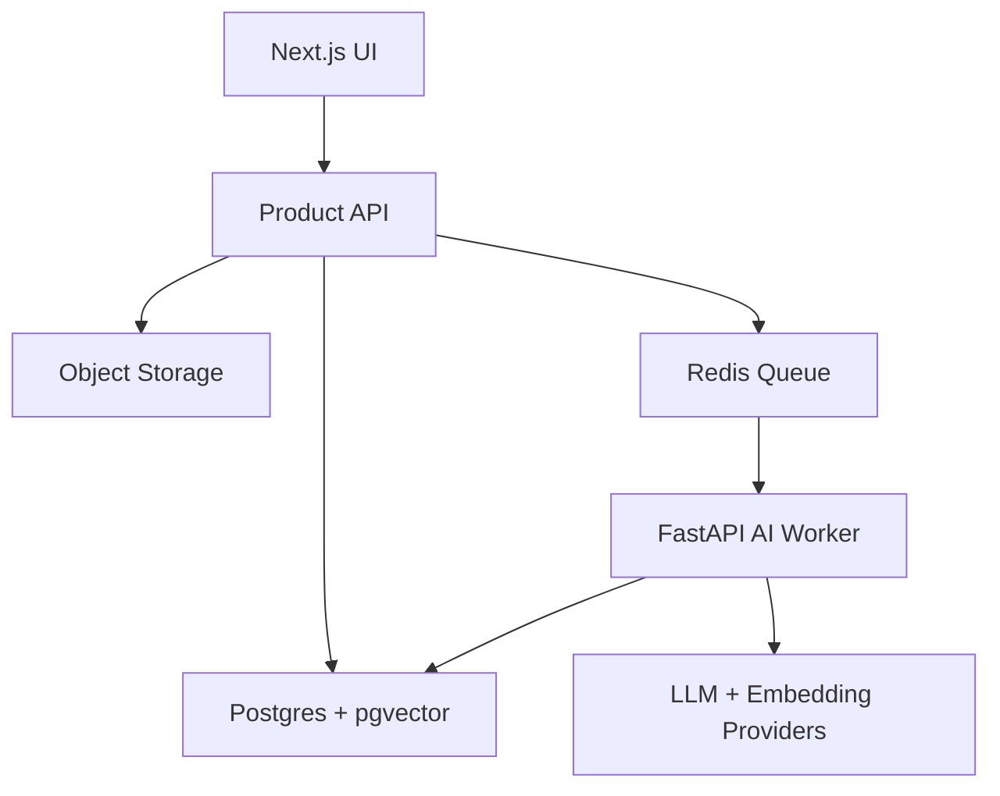

# Module 13: Capstone Build - Arkion DocIntel

## Module Purpose

This module is the product build plan for Arkion DocIntel. It converts everything learned so far into a phased, portfolio-ready B2B SaaS.

The goal is not to build every enterprise feature at once. The goal is to build a serious vertical slice that proves you can design, implement, explain, evaluate, and deploy an applied AI product.

## Learning Outcomes

By the end of this module, you should be able to:

- plan a full capstone build in phases
- implement document upload and processing
- classify documents
- extract structured data
- generate embeddings and semantic search
- build RAG Q&A with citations
- compare documents
- add AI workflows
- create evaluation datasets
- polish product UX and deployment

## Final Mini Build

Complete the portfolio version of Arkion DocIntel:

- working app
- source repository
- README
- architecture diagram
- demo video
- deployment
- known limitations
- future roadmap

---

## 13.1 Phase 1 - Project Setup

Build:

- monorepo
- Next.js frontend
- Node API or API layer
- FastAPI AI service
- PostgreSQL + pgvector
- Redis queue
- environment variables
- basic auth
- workspace model

Deliverable: user can log in and view an empty workspace.

## 13.2 Phase 2 - Document Upload And Processing

Build:

- PDF upload
- file storage
- document record
- processing job
- text extraction
- scanned detection
- metadata storage
- processing status

Deliverable: user uploads a document and sees parsed text metadata.

## 13.3 Phase 3 - Document Classification

Build:

- rule-based classification
- LLM fallback classifier
- labels: invoice, contract, policy, proposal, SOP, unknown
- confidence
- manual correction

Deliverable: document library shows document type.

## 13.4 Phase 4 - Structured Extraction

Build:

- invoice schema
- contract schema
- policy schema
- proposal schema
- Pydantic validation
- extraction result storage
- dashboard display
- JSON/CSV export

Deliverable: user sees useful business fields from documents.

## 13.5 Phase 5 - Embeddings And Search

Build:

- chunking
- embedding generation
- vector storage
- semantic search
- filters by type, date, workspace
- result citations

Deliverable: user can search across documents by meaning.

## 13.6 Phase 6 - RAG Q&A

Build:

- single-document Q&A
- workspace Q&A
- retrieval pipeline
- grounded answer prompt
- citations
- unknown-answer behavior

Deliverable: user asks questions and gets cited answers.

## 13.7 Phase 7 - Document Comparison

Build:

- select two documents
- compare payment terms
- compare dates
- compare clauses
- summarize differences
- flag risks

Deliverable: user compares two vendor agreements or proposals.

## 13.8 Phase 8 - AI Workflows

Build:

- contract risk review
- invoice approval summary
- policy Q&A assistant
- SOP checklist generator
- proposal summary
- action item generator

Deliverable: user runs controlled workflows from document detail pages.

## 13.9 Phase 9 - Evaluation Layer

Build:

- test documents
- expected extraction results
- expected Q&A answers
- extraction accuracy scoring
- citation correctness checks
- prompt versions
- latency and cost tracking

Deliverable: repo proves reliability work, not just demo behavior.

## 13.10 Phase 10 - Production Polish

Build:

- workspace management
- role-based access
- delete document
- error states
- loading states
- usage dashboard
- deployment
- README
- architecture diagram
- demo video

Deliverable: portfolio-grade product presentation.

## Capstone Architecture Diagram

## Capstone Acceptance Criteria

- document upload works
- processing status is visible
- at least invoices and contracts extract fields
- semantic search returns cited chunks
- RAG answers include citations
- unknown answers are handled safely
- one comparison workflow works
- one evaluation script exists
- README explains architecture, setup, demo, limitations, and roadmap

## Quiz

1. Why build in phases?
2. What is the first useful vertical slice?
3. Why should evaluation be part of the capstone?
4. What makes this project stronger than a chatbot?
5. What belongs in the final README?

## Answer Key

1. Phases reduce risk and create visible progress.
2. Upload, parse, classify, extract, and show document data.
3. It proves reliability thinking.
4. It includes ingestion, extraction, search, RAG, workflows, evals, security, and deployment.
5. Overview, architecture, setup, env vars, features, evals, security, limitations, roadmap, demo.

## Interview Questions

1. Walk me through Arkion DocIntel.
2. What was the hardest technical challenge?
3. How did you design the RAG pipeline?
4. How did you evaluate reliability?
5. What would you build next?
